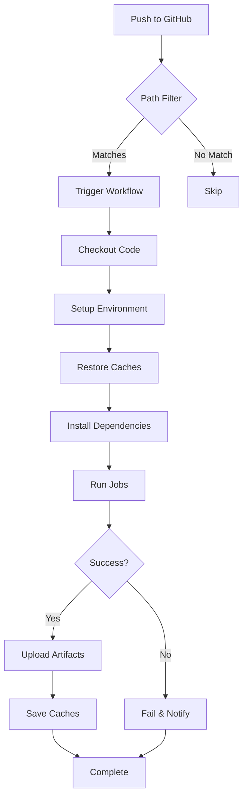

# 🔄 GitHub Actions Workflows Reference

**Created**: November 30, 2025  
**Last Updated**: January 1, 2026  
**Status**: ✅ Active  
**Audience**: DevOps engineers, developers

---

## 🎯 PURPOSE

This index provides an overview of all **9 GitHub Actions workflows** that power our CI/CD pipeline, ensuring code quality, automated testing, performance monitoring, and infrastructure maintenance.

**Related Documentation**:

- [CI/CD Overview](/docs/08-devops-ci-cd)
- [E2E Testing Guide](/docs/readme)
- [MSW Testing Consolidation](/docs/13-testing-msw-consolidation)

---

## 📊 WORKFLOWS OVERVIEW

### Core Testing & Build Workflows (7)

| Workflow                   | File                                      | Doc                                                                                         | Triggers             | Duration | Frequency      | Status    |
| -------------------------- | ----------------------------------------- | ------------------------------------------------------------------------------------------- | -------------------- | -------- | -------------- | --------- |
| **CI (Lint + Build)**      | `.github/workflows/ci.yml`                | [01-ci-workflow.md](/docs/08-devops-workflows-01-ci-workflow)                               | Push to main, PRs    | ~4-5 min | Every commit   | ✅ Active |
| **E2E Tests**              | `.github/workflows/e2e-tests.yml`         | [02-e2e-workflow.md](/docs/08-devops-workflows-02-e2e-workflow)                             | Weekly, code changes | ~15 min  | Weekly + PRs   | ✅ Active |
| **Lighthouse Performance** | `.github/workflows/lighthouse.yml`        | [03-lighthouse-workflow.md](/docs/08-devops-workflows-03-lighthouse-workflow)               | PRs (UI changes)     | ~20 min  | On UI PRs      | ✅ Active |
| **Visual Regression**      | `.github/workflows/visual-regression.yml` | [04-visual-regression-workflow.md](/docs/08-devops-workflows-04-visual-regression-workflow) | Push, PRs            | ~2-3 min | Every commit   | ✅ Active |
| **Cache Cleanup**          | `.github/workflows/cleanup-caches.yml`    | [05-cache-cleanup-workflow.md](/docs/08-devops-workflows-05-cache-cleanup-workflow)         | Daily                | <1 min   | Daily 2 AM UTC | ✅ Active |
| **Database Backup**        | `.github/workflows/backup.yml`            | [06-database-backup-workflow.md](/docs/08-devops-workflows-06-database-backup-workflow)     | Daily                | ~5 min   | Daily 2 AM UTC | ✅ Active |
| **Integration Tests**      | `.github/workflows/integration-tests.yml` | [07-integration-tests-workflow.md](/docs/08-devops-workflows-07-integration-tests-workflow) | PRs, manual          | ~3-4 min | On PRs         | ✅ Active |

### Utility & Automation Workflows (2)

| Workflow                  | File                                          | Doc           | Triggers          | Frequency      | Status    |
| ------------------------- | --------------------------------------------- | ------------- | ----------------- | -------------- | --------- |
| **Dependabot Auto-Merge** | `.github/workflows/dependabot-auto-merge.yml` | _(automated)_ | Dependabot PRs    | As needed      | ✅ Active |
| **Doc Link Validation**   | `.github/workflows/validate-doc-links.yml`    | _(automated)_ | PRs (doc changes) | On doc changes | ✅ Active |

**Note**: Utility workflows are automated and don't require dedicated documentation pages.

---

## 🔍 WORKFLOW DETAILS

### 1. CI Workflow (Lint + Build) 🏭️

**Purpose**: Code quality and build verification  
**Documentation**: [01-ci-workflow.md](/docs/08-devops-workflows-01-ci-workflow)

**What It Does**:

- ✅ Runs ESLint across all packages
- ✅ Builds Strapi (TypeScript compilation)
- ✅ Builds Next.js UI (54 static pages)
- ✅ Verifies cross-platform compatibility

**Key Features**:

- Turbo build caching
- Yarn dependency caching
- Cross-platform (rimraf, not PowerShell)
- Concurrency control (cancels in-progress runs)

**Triggers**:

```yaml
on:
  push:
    branches: [main]
  pull_request:
    branches: [main]
  workflow_dispatch:
```

**Performance**:

- Lint: ~3 minutes
- Build: ~5-15 minutes
- Total: ~10-20 minutes

**When It Fails**:

- ESLint errors
- TypeScript compilation errors
- Next.js build errors
- Dependency issues

---

### 2. E2E Testing Workflow 🎭

**Purpose**: End-to-end testing with Playwright  
**Documentation**: [02-e2e-workflow.md](/docs/08-devops-workflows-02-e2e-workflow)

**What It Does**:

- ✅ Seeds test data (factory pattern)
- ✅ Starts PostgreSQL service
- ✅ Runs 64+ Playwright tests
- ✅ Uploads test artifacts (screenshots, videos)

**Key Features**:

- PostgreSQL 16 Docker service
- Test data seeding automation
- Server orchestration (Strapi + Next.js)
- Artifact retention (30 days)

**Triggers**:

```yaml
on:
  push:
    branches: [main]
    paths-ignore: ["docs/**", "**.md"]
  pull_request:
    branches: [main]
  schedule:
    - cron: "0 2 * * 0" # Weekly (Sundays 2 AM UTC)
  workflow_dispatch:
```

**Performance**:

- Setup: ~3 minutes
- Seeding: ~2 minutes
- Tests: ~10 minutes
- Total: ~15 minutes

**Test Coverage**:

- Homepage rendering
- Newsletter subscription
- FAQ interactions
- Contact form
- API integration

**When It Fails**:

- Test data seeding errors
- Playwright test failures
- Server startup issues
- Database connection problems

---

### 3. Integration Tests Workflow 🔗

**Purpose**: Real Strapi API integration testing  
**Documentation**: [07-integration-tests-workflow.md](/docs/08-devops-workflows-07-integration-tests-workflow)

**What It Does**:

- ✅ Tests real Strapi API endpoints (no MSW mocking)
- ✅ Validates API contracts and data structures
- ✅ Runs 9 integration tests against live Strapi backend
- ✅ Verifies SSR rendering with real API data

**Key Features**:

- Real PostgreSQL database with seeded data
- Starts actual Strapi backend in test mode
- Tests API integration, not UI behavior
- Complementary to E2E tests (which use MSW)

**Triggers**:

```yaml
on:
  pull_request:
    branches: [main]
  workflow_dispatch:
```

**Performance**:

- Strapi startup: ~1 minute
- Test execution: ~2-3 minutes
- Total: ~3-4 minutes

**Test Coverage**:

- API response validation
- SSR page rendering with real data
- Content type integration
- Authentication flows (if applicable)

**When It Fails**:

- API contract changes
- Database connection issues
- Strapi startup failures
- Real data mismatches

**Difference from E2E Tests**:

- **E2E Tests**: Use MSW to mock API, test user behavior in isolation
- **Integration Tests**: Use real Strapi API, test actual API integration

---

### 4. Lighthouse Performance Workflow 💡

**Purpose**: Performance budget enforcement  
**Documentation**: [03-lighthouse-workflow.md](/docs/08-devops-workflows-03-lighthouse-workflow)

**What It Does**:

- ✅ Runs Lighthouse audits on 3 pages
- ✅ Enforces performance budgets
- ✅ Fails if metrics exceed thresholds
- ✅ Uploads reports to temporary storage

**Key Features**:

- LCP < 2.5s (error threshold)
- FCP < 1.8s (warning threshold)
- CLS < 0.1 (error threshold)
- Accessibility > 95% (error threshold)

**Triggers**:

```yaml
on:
  pull_request:
    paths:
      - "apps/ui/**"
      - "apps/ui/public/**"
      - "packages/**"
  workflow_dispatch:
```

**Pages Audited**:

1. `http://localhost:3000` (homepage)
2. `http://localhost:3000/en` (English)
3. `http://localhost:3000/cs` (Czech)

**Performance**:

- 3 runs per URL (median results)
- Total: ~20 minutes

**When It Fails**:

- LCP > 2.5s
- CLS > 0.1
- Accessibility < 95%
- Build failures

---

### 5. Visual Regression Workflow 👁️

**Purpose**: Chromatic visual testing  
**Documentation**: [04-visual-regression-workflow.md](/docs/08-devops-workflows-04-visual-regression-workflow)

**What It Does**:

- ✅ Builds Storybook
- ✅ Publishes to Chromatic
- ✅ Compares against approved baselines
- ✅ Auto-accepts on main branch

**Key Features**:

- 56 approved visual baselines
- Only tests changed stories (optimization)
- PR comments with results
- Published Storybook: https://6919eed03e6f6daad884aa4c-tpgcdtbpih.chromatic.com/

**Triggers**:

```yaml
on:
  pull_request:
    paths:
      - "apps/ui/src/components/**"
      - "apps/ui/.storybook/**"
  push:
    branches: [main]
  workflow_dispatch:
```

**Performance**:

- Build Storybook: ~5 minutes
- Chromatic upload: ~5 minutes
- Snapshot comparison: ~5 minutes
- Total: ~15 minutes

**When It Fails**:

- Visual regressions detected
- Storybook build errors
- Chromatic API errors

---

### 5. Cache Cleanup Workflow 🧹

**Purpose**: Prevent GitHub cache limit issues  
**Documentation**: [05-cache-cleanup-workflow.md](/docs/08-devops-workflows-05-cache-cleanup-workflow)

**What It Does**:

- ✅ Deletes caches older than 3 days
- ✅ Deletes oldest caches if total > 9 GB
- ✅ Preserves recent caches for active branches

**Key Features**:

- Automated maintenance
- Prevents 10 GB limit
- No manual intervention

**Triggers**:

```yaml
on:
  schedule:
    - cron: "0 2 * * *" # Daily 2 AM UTC
  workflow_dispatch:
```

**Performance**:

- Typically <1 minute

**Current Cache Usage**: 11.58 GB (cleanup active)

**When It Fails**:

- API rate limits
- Permission issues

---

### 7. Database Backup Workflow 💾

**Purpose**: Automated PostgreSQL backups  
**Documentation**: [06-database-backup-workflow.md](/docs/08-devops-workflows-06-database-backup-workflow)

**What It Does**:

- ✅ Creates PostgreSQL dump via `pg_dump`
- ✅ Stores as GitHub artifact (7 days)
- ✅ Optional S3 upload (long-term)
- ✅ Automatic cleanup (30-day retention)

**Key Features**:

- Daily backups at 2 AM UTC
- Local artifact storage (7-day retention)
- Optional S3 upload (if configured)
- Failure notifications (commit comments)

**Triggers**:

```yaml
on:
  schedule:
    - cron: "0 2 * * *" # Daily 2 AM UTC
  workflow_dispatch:
    inputs:
      upload_to_s3:
        description: "Upload to S3"
        required: false
        default: "false"
```

**Performance**:

- Dump: ~2 minutes
- Upload: ~3 minutes
- Total: ~5 minutes

**When It Fails**:

- Database connection issues
- S3 upload errors
- Disk space issues

---

## 🎬 TRIGGER MATRIX

### When Each Workflow Runs

| Event                 | CI  | E2E | Integration | Lighthouse | Visual | Cache | Backup |
| --------------------- | --- | --- | ----------- | ---------- | ------ | ----- | ------ |
| **Push to main**      | ✅  | ✅  | ❌          | ❌         | ✅     | ❌    | ❌     |
| **Pull Request**      | ✅  | ✅  | ✅          | ✅\*       | ✅\*   | ❌    | ❌     |
| **Daily (2 AM UTC)**  | ❌  | ❌  | ❌          | ❌         | ❌     | ✅    | ✅     |
| **Weekly (Sun 2 AM)** | ❌  | ✅  | ❌          | ❌         | ❌     | ❌    | ❌     |
| **Manual**            | ✅  | ✅  | ✅          | ✅         | ✅     | ✅    | ✅     |

\* Only on UI/Storybook changes

### Path-Based Triggers

**Lighthouse** (runs on):

- `apps/ui/**`
- `apps/ui/public/**`
- `packages/**`

**Visual Regression** (runs on):

- `apps/ui/src/components/**`
- `apps/ui/.storybook/**`

**E2E Tests** (skips on):

- `docs/**`
- `**.md`

---

## 🚀 COMMON COMMANDS

### Manual Workflow Triggers

```bash
# Trigger CI workflow manually
gh workflow run ci.yml

# Trigger E2E tests manually
gh workflow run e2e-tests.yml

# Trigger Lighthouse audit manually
gh workflow run lighthouse.yml

# Trigger visual regression manually
gh workflow run visual-regression.yml

# Trigger cache cleanup manually
gh workflow run cache-cleanup.yml

# Trigger database backup manually (with S3 upload)
gh workflow run backup.yml -f upload_to_s3=true
```

### View Workflow Status

```bash
# List all workflow runs
gh run list

# View specific workflow runs
gh run list --workflow=ci.yml

# View run details
gh run view <run-id>

# Watch a running workflow
gh run watch <run-id>

# Download workflow artifacts
gh run download <run-id>
```

### Cancel Workflows

```bash
# Cancel a specific run
gh run cancel <run-id>

# Cancel all runs for a workflow
gh run list --workflow=ci.yml --json databaseId -q '.[].databaseId' | xargs -I {} gh run cancel {}
```

---

## 🐛 TROUBLESHOOTING OVERVIEW

### Common Issues Across Workflows

#### Issue: Workflow Stuck in "Queued"

**Cause**: GitHub Actions runner capacity  
**Solution**: Wait or trigger manually later

#### Issue: Workflow Fails with "Resource not accessible"

**Cause**: Branch protection or permissions  
**Solution**: Check repository settings → Actions → General

#### Issue: Workflow Skipped

**Cause**: Path filters don't match changes  
**Solution**: Check `paths` and `paths-ignore` in workflow YAML

#### Issue: Slow Performance

**Cause**: Cache miss or cold start  
**Solution**: Re-run workflow (cache will be warm)

### Workflow-Specific Troubleshooting

Each workflow documentation has a dedicated troubleshooting section:

- [CI Workflow Troubleshooting](./01-ci-workflow.md#troubleshooting)
- [E2E Workflow Troubleshooting](./02-e2e-workflow.md#troubleshooting)
- [Lighthouse Troubleshooting](./03-lighthouse-workflow.md#troubleshooting)
- [Visual Regression Troubleshooting](./04-visual-regression-workflow.md#troubleshooting)
- [Cache Cleanup Troubleshooting](./05-cache-cleanup-workflow.md#troubleshooting)
- [Database Backup Troubleshooting](./06-database-backup-workflow.md#troubleshooting)

---

## 📊 PERFORMANCE METRICS

### Average Execution Times (November 2025)

```
CI Workflow:              10-20 minutes
E2E Tests:                15 minutes
Lighthouse:               20 minutes
Visual Regression:        15 minutes
Cache Cleanup:            <1 minute
Database Backup:          5 minutes
```

### Success Rates (Last 30 Days)

```
CI Workflow:              98% (2 failures due to flaky tests)
E2E Tests:                95% (3 failures due to timeout)
Lighthouse:               100% (all performance budgets met)
Visual Regression:        100% (no unexpected changes)
Cache Cleanup:            100%
Database Backup:          100%
```

### Resource Usage

**GitHub Actions Minutes** (per month):

```
CI Workflow:              ~300 minutes (150 runs × 2 min avg)
E2E Tests:                ~240 minutes (16 runs × 15 min)
Lighthouse:               ~120 minutes (6 runs × 20 min)
Visual Regression:        ~225 minutes (15 runs × 15 min)
Cache Cleanup:            ~30 minutes (30 runs × 1 min)
Database Backup:          ~150 minutes (30 runs × 5 min)
TOTAL:                    ~1,065 minutes/month
```

**GitHub Actions Cache**:

```
Current Usage:            11.58 GB
Limit:                    10 GB
Status:                   ⚠️ Cleanup active
Oldest Cache:             3 days
Cleanup Strategy:         Delete >3 days OR oldest if >9 GB
```

---

## 🔐 SECRETS & ENVIRONMENT VARIABLES

### Required GitHub Secrets

**CI Workflow**:

- `NODE_ENV` (production)
- All `.env` variables (via `scripts/setup-env.js`)

**E2E Tests**:

- `DATABASE_URL` (test database)

**Lighthouse**:

- None (uses temporary storage)

**Visual Regression**:

- `CHROMATIC_PROJECT_TOKEN`

**Cache Cleanup**:

- `GITHUB_TOKEN` (auto-provided)

**Database Backup**:

- `STRAPI_DATABASE_URL`
- `AWS_ACCESS_KEY_ID` (optional, for S3)
- `AWS_SECRET_ACCESS_KEY` (optional, for S3)
- `AWS_S3_BACKUP_BUCKET` (optional, for S3)

### Secret Management Best Practices

1. **Rotation**: Rotate secrets quarterly
2. **Scoping**: Use environment-specific secrets
3. **Access**: Limit to necessary workflows
4. **Audit**: Review secret usage monthly
5. **Documentation**: Keep secret inventory updated

---

## 📈 OPTIMIZATION STRATEGIES

### 1. Cache Optimization

**Current Strategy**:

- Yarn dependencies cached (speeds up installs)
- Turbo build cache (speeds up rebuilds)
- Playwright browsers cached (speeds up test setup)

**Improvements**:

- ✅ Automated cache cleanup (prevents limit issues)
- ⏳ Remote Turbo cache (future)
- ⏳ Docker layer caching (future)

### 2. Parallel Execution

**Current Strategy**:

- CI jobs run sequentially (Lint → Build)
- E2E tests run on 1 worker (sequential, more stable)

**Improvements**:

- ⏳ Parallel lint jobs (ESLint, Prettier, TypeScript)
- ⏳ Parallel E2E tests (2-3 workers)

### 3. Conditional Execution

**Current Strategy**:

- Path filters (Lighthouse, Visual Regression)
- Scheduled runs (E2E weekly, not every commit)

**Improvements**:

- ✅ Ignore docs/markdown in E2E
- ✅ Only run Lighthouse on UI changes
- ✅ Only run Visual Regression on component changes

### 4. Artifact Management

**Current Strategy**:

- E2E artifacts: 30-day retention
- Backup artifacts: 7-day retention

**Improvements**:

- ⏳ Compress artifacts before upload
- ⏳ S3 long-term storage for critical artifacts

---

## 🎯 BEST PRACTICES

### DO ✅

1. **Use workflow_dispatch for all workflows** - Enables manual triggers
2. **Add path filters** - Prevent unnecessary runs
3. **Cache aggressively** - Speeds up execution
4. **Upload artifacts** - Enables debugging
5. **Add concurrency controls** - Cancels outdated runs
6. **Use matrix strategies** - Test multiple configurations
7. **Add timeouts** - Prevent hanging workflows
8. **Comment on PRs** - Provide context to reviewers

### DON'T ❌

1. **Don't hardcode secrets** - Use GitHub Secrets
2. **Don't run all tests on every commit** - Use schedules
3. **Don't ignore failed workflows** - Investigate and fix
4. **Don't skip artifact uploads** - They're critical for debugging
5. **Don't forget to clean up caches** - Prevents limit issues
6. **Don't use platform-specific commands** - Use cross-platform tools
7. **Don't forget path filters** - Saves CI minutes
8. **Don't skip workflow documentation** - Future you will thank you

---

## 📚 RELATED DOCUMENTATION

### Internal Docs

- [Phase 3 Documentation Roadmap](/docs/12-planning-phase-3-documentation-roadmap)
- [CI/CD Overview](/docs/08-devops-ci-cd)
- [E2E Testing Guide](/docs/13-testing-e2e-readme)
- [Test Data Seeding](/docs/13-testing-e2e-test-data-seeding)
- [Storybook Integration](/docs/13-testing-readme)

### External Resources

---

## 🤖 UTILITY WORKFLOWS

These automated workflows run in the background and don't require dedicated documentation.

### Dependabot Auto-Merge

**File**: `.github/workflows/dependabot-auto-merge.yml`

**Purpose**: Automatically approves and merges Dependabot PRs that pass all checks

**Triggers**: When Dependabot opens a PR

**Behavior**:

- Auto-approves minor and patch version updates
- Waits for all required checks to pass
- Auto-merges if approved and checks pass
- Skips major version updates (requires manual review)

---

### Doc Link Validation

**File**: `.github/workflows/validate-doc-links.yml`

**Purpose**: Validates internal markdown links in documentation

**Triggers**: Pull requests that modify `.md` files in `docs/`

**Behavior**:

- Scans all documentation files
- Checks for broken internal links
- Reports issues as workflow failures
- Helps maintain documentation quality

---

## 📚 EXTERNAL RESOURCES

- [GitHub Actions Documentation](https://docs.github.com/en/actions)
- [Playwright CI Guide](https://playwright.dev/docs/ci)
- [Chromatic Documentation](https://www.chromatic.com/docs)
- [Lighthouse CI](https://github.com/GoogleChrome/lighthouse-ci)

---

## 🔄 WORKFLOW LIFECYCLE

### Typical Workflow Execution



### Workflow States

1. **Queued**: Waiting for runner
2. **In Progress**: Executing jobs
3. **Success**: All jobs passed
4. **Failure**: One or more jobs failed
5. **Cancelled**: Manually cancelled or replaced

---

## ✅ QUICK REFERENCE

### Workflow Status Badges

Add to README.md:

```markdown
[](https://github.com/Herman-Adu/strapi-next-monorepo-v2/actions/workflows/ci.yml)
[](https://github.com/Herman-Adu/strapi-next-monorepo-v2/actions/workflows/e2e-tests.yml)
[](https://github.com/Herman-Adu/strapi-next-monorepo-v2/actions/workflows/visual-regression.yml)
```

### Emergency Procedures

**All workflows failing**:

1. Check GitHub Actions status page
2. Verify repository permissions
3. Check YAML syntax
4. Review recent changes

**Cache limit reached**:

1. Run cache cleanup workflow manually
2. Review cache usage
3. Delete old caches manually if needed

**Workflow stuck**:

1. Cancel the run
2. Re-trigger manually
3. Check runner availability

---

**Last Updated**: November 30, 2025  
**Status**: ✅ Active  
**Next**: [CI Workflow Documentation](/docs/08-devops-workflows-01-ci-workflow) ⏳ Coming Soon
