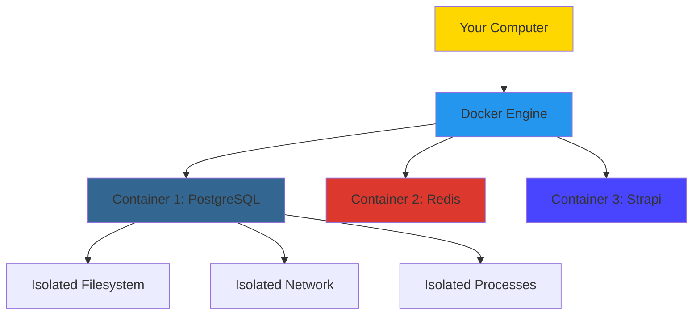
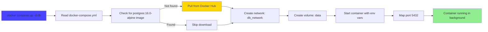
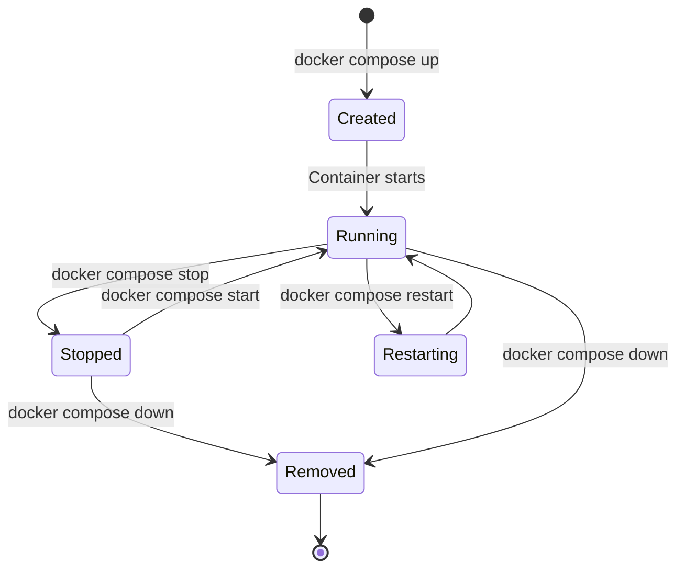

# 🐳 Docker & Containerization - Fundamentals

**Level**: Intermediate (Requires basic command-line knowledge)  
**Time**: 50 minutes  
**Goal**: Master Docker for local development with PostgreSQL and understand container basics

---

## 📖 What You'll Learn

By the end of this guide, you'll be able to:

✅ Understand what Docker is and why it matters  
✅ Run PostgreSQL in a container for Strapi development  
✅ Use Docker Compose for multi-container orchestration  
✅ Manage container lifecycle (start, stop, inspect, logs)  
✅ Understand volumes for data persistence  
✅ Debug common Docker issues confidently

---

## 🎯 The Problem Docker Solves

**Traditional Development Setup**:

```
Developer A:
- Windows 11
- PostgreSQL 15 installed globally
- Port 5432 in use
- Custom database config

Developer B:
- macOS Ventura
- PostgreSQL 14 installed via Homebrew
- Port 5432 in use
- Different database config

Developer C:
- Ubuntu 22.04
- PostgreSQL 16 compiled from source
- Custom port 5433
- Different database config

Result:
❌ "Works on my machine" syndrome
❌ Onboarding takes 4-8 hours
❌ Environment inconsistencies cause bugs
❌ Production ≠ Development
```

**Docker Approach**:

```
All Developers:
- Docker Desktop installed
- Run: docker compose up -d db
- PostgreSQL 16 Alpine container
- Identical configuration
- Isolated from host system

Result:
✅ Identical environments (dev = staging = production)
✅ Onboarding takes 5 minutes
✅ No "works on my machine"
✅ Easy cleanup (docker compose down)
```

---

## 🏗️ Part 1: Docker Fundamentals (15 minutes)

### What is Docker?

**Container**: Lightweight, isolated environment running your application and dependencies.



**Key Concepts**:

1. **Image**: Blueprint for a container (like a class in OOP)
2. **Container**: Running instance of an image (like an object)
3. **Volume**: Persistent data storage outside the container
4. **Network**: Communication channel between containers
5. **docker-compose.yml**: Configuration file for multi-container apps

**Analogy**:

```
Image    = Recipe
Container = Cooked dish
Volume   = Leftover storage (persists after dish is eaten)
Network  = Table where dishes communicate
```

---

### Docker vs Virtual Machines

```
Virtual Machine:
┌─────────────────────────────────────┐
│ App A     │ App B     │ App C       │
├─────────────────────────────────────┤
│ Guest OS  │ Guest OS  │ Guest OS    │  ← Full OS per app (slow, heavy)
├─────────────────────────────────────┤
│ Hypervisor (VMware, VirtualBox)     │
├─────────────────────────────────────┤
│ Host Operating System               │
├─────────────────────────────────────┤
│ Hardware (CPU, RAM, Disk)           │
└─────────────────────────────────────┘

Size: 10-50 GB per VM
Startup: 30-60 seconds
RAM: 2-4 GB per VM


Docker Container:
┌─────────────────────────────────────┐
│ App A     │ App B     │ App C       │
├─────────────────────────────────────┤
│ Docker Engine                       │  ← Shared OS kernel (fast, light)
├─────────────────────────────────────┤
│ Host Operating System               │
├─────────────────────────────────────┤
│ Hardware (CPU, RAM, Disk)           │
└─────────────────────────────────────┘

Size: 50-500 MB per container
Startup: 1-5 seconds
RAM: 50-200 MB per container
```

**Why Docker Wins**:

- **Fast**: Start in seconds, not minutes
- **Lightweight**: MB vs GB
- **Consistent**: Same environment everywhere
- **Isolated**: Apps don't interfere
- **Disposable**: Delete and recreate easily

---

## 🚀 Part 2: PostgreSQL with Docker Compose (20 minutes)

### Step 1: Install Docker Desktop

**Windows/macOS**:

1. Download [Docker Desktop](https://www.docker.com/products/docker-desktop)
2. Install and start Docker Desktop
3. Verify installation:

```powershell
docker --version
# Docker version 24.0.7, build afdd53b

docker compose version
# Docker Compose version v2.23.0
```

**Linux** (Ubuntu):

```bash
# Add Docker repository
sudo apt-get update
sudo apt-get install ca-certificates curl gnupg
sudo install -m 0755 -d /etc/apt/keyrings
curl -fsSL https://download.docker.com/linux/ubuntu/gpg | sudo gpg --dearmor -o /etc/apt/keyrings/docker.gpg

# Install Docker
sudo apt-get update
sudo apt-get install docker-ce docker-ce-cli containerd.io docker-buildx-plugin docker-compose-plugin

# Verify
docker --version
docker compose version
```

---

### Step 2: Understand docker-compose.yml

**Our Real Configuration**: `apps/strapi/docker-compose.yml`

```yaml
# This docker-compose file contains only Postgres database for local run.
# Strapi should be run either in a separate container (Dockerfile) or in the host machine (yarn dev).

name: monorepo-next-js-strapi
services:
  db:
    platform: linux/amd64 #for platform error on Apple M1 chips
    restart: unless-stopped
    env_file: .env
    image: postgres:16.0-alpine
    environment:
      POSTGRES_USER: ${DATABASE_USERNAME}
      POSTGRES_PASSWORD: ${DATABASE_PASSWORD}
      POSTGRES_DB: ${DATABASE_NAME}
    volumes:
      - data:/var/lib/postgresql/data/ #using a volume
      #- ./data:/var/lib/postgresql/data/ # if you want to use a bind folder
    ports:
      - "5432:5432"
    networks:
      - db_network

volumes:
  data:

networks:
  db_network:
    driver: bridge
```

**Line-by-Line Explanation**:

```yaml
name: monorepo-next-js-strapi
# Project name (shows in Docker Desktop)

services:
  db:
    # Service name (accessible as 'db' inside other containers)

    platform: linux/amd64
    # Force x86_64 architecture (fixes Apple M1 issues)

    restart: unless-stopped
    # Auto-restart container if it crashes (unless manually stopped)

    env_file: .env
    # Load environment variables from .env file

    image: postgres:16.0-alpine
    # Image: postgres (PostgreSQL database)
    # Tag: 16.0-alpine (version 16, Alpine Linux = smaller size)
    # Full name: postgres:16.0-alpine from Docker Hub

    environment:
      POSTGRES_USER: ${DATABASE_USERNAME} # Admin user
      POSTGRES_PASSWORD: ${DATABASE_PASSWORD} # Admin password
      POSTGRES_DB: ${DATABASE_NAME} # Database name
    # Environment variables passed to container
    # ${VAR} reads from .env file

    volumes:
      - data:/var/lib/postgresql/data/
    # Named volume 'data' → Container path
    # Data persists even if container is deleted

    ports:
      - "5432:5432"
    # Host port : Container port
    # Accessible at localhost:5432

    networks:
      - db_network
    # Connect to custom network (containers can talk to each other)

volumes:
  data:
# Named volume definition (Docker manages storage location)

networks:
  db_network:
    driver: bridge
# Custom network definition (bridge = default, allows inter-container communication)
```

---

### Step 3: Start PostgreSQL Container

```powershell
# Navigate to Strapi directory
cd apps/strapi

# Start database container (detached mode)
docker compose up -d db

# Output:
# [+] Running 2/2
#  ✔ Network monorepo-next-js-strapi_db_network  Created  0.1s
#  ✔ Container monorepo-next-js-strapi-db-1      Started  0.5s
```

**What Just Happened**:



**First Run** (downloads image):

```
[+] Pulling db (postgres:16.0-alpine)
16.0-alpine: Pulling from library/postgres
31e352740f53: Pull complete
1e4c6cfa3d13: Pull complete
...
Digest: sha256:abc123...
Status: Downloaded newer image for postgres:16.0-alpine
```

**Subsequent Runs** (instant):

```
[+] Running 1/1
 ✔ Container monorepo-next-js-strapi-db-1  Started  0.3s
```

---

### Step 4: Verify Container is Running

```powershell
# List running containers
docker ps

# Output:
# CONTAINER ID   IMAGE                    STATUS         PORTS                    NAMES
# a1b2c3d4e5f6   postgres:16.0-alpine     Up 2 minutes   0.0.0.0:5432->5432/tcp   monorepo-next-js-strapi-db-1
```

**Understanding Output**:

```
CONTAINER ID: a1b2c3d4e5f6
  → Unique identifier (use for docker commands)

IMAGE: postgres:16.0-alpine
  → Image and version

STATUS: Up 2 minutes
  → Running for 2 minutes (healthy)

PORTS: 0.0.0.0:5432->5432/tcp
  → Host 5432 → Container 5432 (accessible via localhost:5432)

NAMES: monorepo-next-js-strapi-db-1
  → Human-readable name (use for docker commands)
```

**Alternative Check**:

```powershell
# Docker Compose specific
docker compose ps

# Output:
# NAME                             IMAGE                    STATUS
# monorepo-next-js-strapi-db-1     postgres:16.0-alpine     Up 3 minutes
```

---

### Step 5: Inspect Container Details

```powershell
# Get detailed container information
docker inspect monorepo-next-js-strapi-db-1

# Or using compose
docker compose inspect db
```

**Useful Information**:

```json
{
  "NetworkSettings": {
    "IPAddress": "172.18.0.2",
    "Ports": {
      "5432/tcp": [{ "HostIp": "0.0.0.0", "HostPort": "5432" }]
    },
    "Networks": {
      "monorepo-next-js-strapi_db_network": {
        "Gateway": "172.18.0.1",
        "IPAddress": "172.18.0.2"
      }
    }
  },
  "Mounts": [
    {
      "Type": "volume",
      "Name": "monorepo-next-js-strapi_data",
      "Source": "/var/lib/docker/volumes/monorepo-next-js-strapi_data/_data",
      "Destination": "/var/lib/postgresql/data"
    }
  ]
}
```

---

### Step 6: View Container Logs

```powershell
# Follow logs in real-time
docker logs -f monorepo-next-js-strapi-db-1

# Output:
# PostgreSQL Database directory appears to contain a database; Skipping initialization
# 2025-12-01 10:30:00.000 UTC [1] LOG:  starting PostgreSQL 16.0 on x86_64-pc-linux-musl
# 2025-12-01 10:30:00.100 UTC [1] LOG:  listening on IPv4 address "0.0.0.0", port 5432
# 2025-12-01 10:30:00.200 UTC [1] LOG:  database system is ready to accept connections
```

**Log Commands**:

```powershell
# Last 50 lines
docker logs --tail 50 monorepo-next-js-strapi-db-1

# Logs since specific time
docker logs --since 2025-12-01T10:00:00 monorepo-next-js-strapi-db-1

# Logs with timestamps
docker logs -t monorepo-next-js-strapi-db-1

# Docker Compose shorthand
docker compose logs db
docker compose logs -f db  # Follow
```

---

## 🔧 Part 3: Container Lifecycle Management (10 minutes)

### Start/Stop/Restart Commands

```powershell
# Stop container (graceful shutdown)
docker compose stop db

# Start stopped container
docker compose start db

# Restart container
docker compose restart db

# Stop and remove container (keeps volume data)
docker compose down

# Stop, remove container AND volume data (⚠️ deletes database!)
docker compose down -v
```

**Mermaid Lifecycle**:



---

### Data Persistence with Volumes

**Without Volumes**:

```
1. Create container
2. Add data to database (100 blog posts)
3. Stop container: docker compose down
4. Start container: docker compose up
5. Data lost ❌ (empty database)
```

**With Volumes** (Our Setup):

```
1. Create container + volume
2. Add data to database (100 blog posts)
3. Stop container: docker compose down
4. Start container: docker compose up
5. Data persists ✅ (100 blog posts still there)
```

**Volume Commands**:

```powershell
# List volumes
docker volume ls

# Output:
# DRIVER    VOLUME NAME
# local     monorepo-next-js-strapi_data

# Inspect volume
docker volume inspect monorepo-next-js-strapi_data

# Output:
# [
#   {
#     "Name": "monorepo-next-js-strapi_data",
#     "Driver": "local",
#     "Mountpoint": "/var/lib/docker/volumes/monorepo-next-js-strapi_data/_data",
#     "Scope": "local"
#   }
# ]

# Remove volume (⚠️ deletes all database data!)
docker volume rm monorepo-next-js-strapi_data
```

**Volume Types**:

```yaml
# Named Volume (Docker manages location)
volumes:
  - data:/var/lib/postgresql/data/
# Pros: Docker handles location, portable, managed cleanup
# Cons: Less control over file location

# Bind Mount (Specific host path)
volumes:
  - ./data:/var/lib/postgresql/data/
# Pros: Direct access to files, easy backup
# Cons: Host-specific paths, permission issues on Windows
```

---

### Connecting Strapi to PostgreSQL Container

**Strapi Environment Variables**: `apps/strapi/.env`

```env
# Database Configuration
DATABASE_CLIENT=postgres
DATABASE_HOST=localhost  # Container accessible at localhost
DATABASE_PORT=5432       # Mapped port from docker-compose.yml
DATABASE_NAME=strapi_db  # From POSTGRES_DB
DATABASE_USERNAME=postgres  # From POSTGRES_USER
DATABASE_PASSWORD=postgres  # From POSTGRES_PASSWORD
DATABASE_SSL=false       # No SSL for local development
```

**Start Strapi**:

```powershell
# Database already running in container
# Start Strapi on host machine
cd apps/strapi
yarn develop

# Output:
# ✔ Connected to PostgreSQL database
# ✔ Migrations complete
# ✔ Server started on http://localhost:1337
```

**Connection Flow**:


---

## 🎯 Fundamentals Certification Checklist

You've mastered Docker fundamentals if you can:

- [ ] Explain the difference between images and containers
- [ ] Start PostgreSQL with docker compose up -d
- [ ] View running containers with docker ps
- [ ] Check container logs with docker logs
- [ ] Understand volume persistence
- [ ] Stop and restart containers
- [ ] Connect Strapi to containerized PostgreSQL
- [ ] Troubleshoot common container issues

---

## 💡 Key Concepts Review

### 1. Containers Are Disposable

```
Philosophy: Treat containers as cattle, not pets.

Cattle: Delete and recreate anytime, data in volumes
Pets: Pamper and maintain, afraid to restart

Docker encourages cattle approach:
- Container dies? Start a new one (5 seconds)
- Need different version? Change image tag, restart
- Testing migration? Create fresh container, test, delete
```

### 2. Images Are Blueprints

```
Image: postgres:16.0-alpine
- Frozen snapshot of PostgreSQL 16.0
- Never changes (immutable)
- Downloaded once, reused forever

Container: Running instance
- Based on image
- Can be created/stopped/started/deleted
- Many containers from one image
```

### 3. Volumes Persist Data

```
Without volumes:
Container data → Lost on container removal

With volumes:
Container data → Stored in volume → Survives container removal

Best practice: Always use volumes for databases
```

### 4. Networks Enable Communication

```
Same Network:
Container A → Container B (by service name)
db → redis → strapi (all connected via db_network)

Different Networks:
Container A ✗ Container B (isolated)
```

---

## 🚀 Next Steps

**You're Ready For**:

- [Docker Production](/docs/14-deep-dives-docker-02-production) - Multi-stage builds, optimization, CI/CD
- Running Strapi in a container (Dockerfile)
- Multi-container apps (Strapi + PostgreSQL + Redis)
- Docker Compose for full stack (frontend + backend + database)

**Try This Exercise** (30 minutes):

1. **Run pgAdmin** (PostgreSQL GUI):

```yaml
# Add to docker-compose.yml
pgadmin:
  image: dpage/pgadmin4:latest
  environment:
    PGADMIN_DEFAULT_EMAIL: admin@example.com
    PGADMIN_DEFAULT_PASSWORD: admin
  ports:
    - "5050:80"
  networks:
    - db_network
```

```powershell
docker compose up -d pgadmin
# Visit http://localhost:5050
# Login: admin@example.com / admin
# Connect to db: hostname=db, port=5432, user=postgres
```

2. **Test Data Persistence**:

```powershell
# Create database data
cd apps/strapi
yarn develop
# Create 5 blog posts in admin panel

# Stop containers
docker compose down

# Restart containers
docker compose up -d

# Start Strapi again
yarn develop
# Verify: 5 blog posts still there ✅
```

3. **Inspect Volume Data**:

```powershell
# Enter PostgreSQL container
docker exec -it monorepo-next-js-strapi-db-1 sh

# Inside container
ls /var/lib/postgresql/data/
# Shows: base/ global/ pg_wal/ ... (PostgreSQL data files)

# Connect to database
psql -U postgres -d strapi_db

# Run query
SELECT * FROM blogs;

# Exit
\q
exit
```

---

## 🐛 Common Issues & Solutions

### Issue 1: "Port 5432 already in use"

**Cause**: PostgreSQL already installed on host machine

**Fix Option 1** (Stop host PostgreSQL):

```powershell
# Windows
Stop-Service -Name postgresql*

# macOS
brew services stop postgresql

# Linux
sudo systemctl stop postgresql
```

**Fix Option 2** (Change container port):

```yaml
# docker-compose.yml
ports:
  - "5433:5432" # Host port 5433 → Container port 5432

# .env
DATABASE_PORT=5433
```

---

### Issue 2: "Container keeps restarting"

**Cause**: Wrong environment variables

**Debug**:

```powershell
# Check logs for error
docker logs monorepo-next-js-strapi-db-1

# Common error:
# FATAL: password authentication failed for user "postgres"
```

**Fix**: Verify `.env` values match `docker-compose.yml`

---

### Issue 3: "Cannot connect to database from Strapi"

**Cause**: Network mismatch or wrong host

**Fix**:

```env
# .env
DATABASE_HOST=localhost  # ✅ Correct (host machine → container)
# DATABASE_HOST=db       # ❌ Wrong (only works inside containers)
```

---

### Issue 4: "Lost all data after docker compose down"

**Cause**: Used `-v` flag (deletes volumes)

**Prevention**:

```powershell
# Safe: Keeps data
docker compose down

# Dangerous: Deletes data
docker compose down -v  # Only use when you want fresh start
```

**Recovery**: No recovery if volume deleted. Always backup important data.

---

## 📚 Additional Resources

**Official Docs**:

- [Docker Documentation](https://docs.docker.com/)
- [Docker Compose Reference](https://docs.docker.com/compose/)
- [PostgreSQL Docker Image](https://hub.docker.com/_/postgres)

**Our Monorepo**:

- [docker-compose.yml](../../../apps/strapi/docker-compose.yml)
- [Strapi Dockerfile](../../../apps/strapi/Dockerfile) (Production)
- [Environment Setup](../../../apps/strapi/.env.example)

**Learning Resources**:

- [Docker Getting Started](https://docs.docker.com/get-started/)
- [Play with Docker](https://labs.play-with-docker.com/) - Browser-based practice

---

## 🎓 What You've Accomplished

**Technical Skills**:
✅ Understood Docker container fundamentals  
✅ Ran PostgreSQL in isolated container  
✅ Managed container lifecycle (start/stop/logs)  
✅ Configured data persistence with volumes  
✅ Connected Strapi to containerized database

**Strategic Understanding**:
✅ Why Docker eliminates "works on my machine"  
✅ How containers enable reproducible environments  
✅ Benefits of isolation and disposability  
✅ Data persistence strategies

**Time Saved**:

```
Traditional Setup:
- Install PostgreSQL (platform-specific): 30 min
- Configure PostgreSQL: 20 min
- Troubleshoot version conflicts: 60 min
- Document setup for team: 30 min
- Total: 2.5 hours

Docker Setup:
- Install Docker Desktop: 5 min
- Run docker compose up: 30 seconds
- Document: Already done (docker-compose.yml)
- Total: 5 minutes

Saved: 2.4 hours per developer
Team of 5: 12 hours saved
```

**You're ready for production Docker patterns!** 🎉

---

**Next**: [Docker Production](/docs/14-deep-dives-docker-02-production) - Multi-stage builds, optimization, and deployment

---

**Last Updated**: December 1, 2025  
**Article**: Docker & Containerization - Fundamentals  
**Part of**: [Deep Dives - Technical Mastery](/docs/14-deep-dives-readme)
