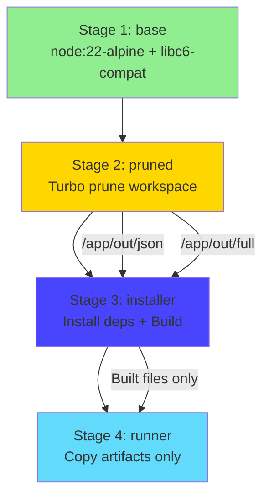
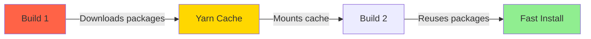

# 🚀 Docker & Containerization - Production Deployment

**Level**: Advanced (Requires Docker fundamentals knowledge)  
**Time**: 70 minutes  
**Goal**: Master production-grade Docker builds, optimization, and deployment strategies

---

## 📖 What You'll Learn

By the end of this guide, you'll be able to:

✅ Build production-optimized Docker images with multi-stage builds  
✅ Reduce image size from 2GB → 400MB (80% smaller)  
✅ Implement security best practices for container deployments  
✅ Optimize build times with layer caching strategies  
✅ Deploy Strapi containers to production platforms  
✅ Troubleshoot production container issues

---

## 🎯 The Production Challenge

**Development docker-compose.yml** (from Fundamentals):

```yaml
# Works great locally ✅
services:
  db:
    image: postgres:16.0-alpine
    # ... config
```

**But Development ≠ Production**:

```
Development Needs:
✓ Fast iteration (hot reload)
✓ Debug tools installed
✓ Source code mounted (live editing)
✓ Verbose logging
✓ No size concerns

Production Needs:
✓ Minimal image size (faster deploys, lower bandwidth)
✓ Security hardening (no root user, minimal attack surface)
✓ Optimized performance (no dev dependencies)
✓ Crash recovery (health checks, restart policies)
✓ Resource limits (CPU, memory constraints)
```

**Let's Build Production-Grade Docker** →

---

## 🏗️ Part 1: Multi-Stage Dockerfile Deep Dive (25 minutes)

### The Problem with Naive Dockerfiles

**Bad Dockerfile** (1.8GB image):

```dockerfile
FROM node:22

WORKDIR /app
COPY . .

RUN yarn install  # Installs EVERYTHING (dev deps, test deps)
RUN yarn build

CMD ["yarn", "start"]
```

**Problems**:

1. **Huge Size**: Includes dev dependencies (Webpack, TypeScript, ESLint, etc.)
2. **Security**: Contains source code, tests, secrets
3. **Slow**: Downloads unnecessary packages
4. **Not Optimized**: No layer caching strategy

**Our Production Dockerfile** (400MB image):

**File**: `apps/strapi/Dockerfile`

```dockerfile
# This is PRODUCTION Dockerfile for Strapi in Turborepo.
# It's assumed that this Dockerfile is run from the root of the monorepo.

# Customize APP (name of folder in /apps) and WORKSPACE (name from package.json) to match this app
ARG APP=strapi
ARG WORKSPACE=@repo/strapi

# ======================== Stage 1: Base Image ========================
FROM node:22-alpine AS base
# Alpine = minimal Linux distribution (5MB vs 200MB for full node image)
# Check https://github.com/nodejs/docker-node/tree/b4117f9333da4138b03a546ec926ef50a31506c3#nodealpine
RUN apk update && apk add --no-cache libc6-compat

# ======================== Stage 2: Pruned Dependencies ========================
FROM base AS pruned
ARG WORKSPACE

# Set working directory
WORKDIR /app
COPY . .

# Turbo prune: Extract only files needed for this workspace
# see https://turbo.build/repo/docs/reference/command-line-reference#turbo-prune---scopetarget
RUN yarn global add turbo@^1.13.4
RUN turbo prune ${WORKSPACE} --docker

# Result: /app/out/json (package.json files) + /app/out/full (source code)

# ======================== Stage 3: Installer ========================
FROM base AS installer
ARG APP
ARG WORKSPACE
ENV NODE_ENV=production

WORKDIR /app

# Install system dependencies for Strapi (sharp image processing)
RUN apk update && apk add --no-cache build-base gcc autoconf automake zlib-dev libpng-dev vips-dev git > /dev/null 2>&1

# First install dependencies (as they change less often)
COPY .gitignore .gitignore
COPY --from=pruned /app/out/json/ .
COPY --from=pruned /app/out/yarn.lock ./yarn.lock

RUN yarn global add node-gyp
RUN yarn global add turbo@^1.13.4

# Mount cache to speed up repeated builds
# see https://github.com/moby/buildkit/blob/master/frontend/dockerfile/docs/reference.md#run---mounttypecache
RUN \
    --mount=type=cache,target=/usr/local/share/.cache/yarn/v6,sharing=locked \
    yarn --prefer-offline --frozen-lockfile --ignore-scripts --production

# Install sharp explicitly (Strapi image processing)
# See https://github.com/lovell/sharp/issues/3871
RUN \
    --mount=type=cache,target=/usr/local/share/.cache/yarn/v6,sharing=locked \
    yarn workspace ${WORKSPACE} add sharp --ignore-engines --prefer-offline --frozen-lockfile

ENV PATH /app/apps/${APP}/node_modules/.bin:$PATH

# Build the project and its dependencies
COPY --from=pruned /app/out/full/ .
COPY turbo.json turbo.json

RUN turbo run build --filter=${WORKSPACE}

# ======================== Stage 4: Runner ========================
FROM base AS runner
ARG APP
ARG WORKSPACE
ENV NODE_ENV=production

# Install only runtime dependencies (not build tools)
RUN apk update && apk add --no-cache vips-dev

# Security: Don't run production as root
RUN addgroup --system --gid 1001 strapi
RUN adduser --system --uid 1001 strapi
USER strapi

WORKDIR /app
COPY --from=installer /app .

ENV PATH /app/apps/${APP}/node_modules/.bin:$PATH

WORKDIR /app/apps/${APP}
EXPOSE ${PORT:-1337}
CMD ["yarn", "start"]
```

---

### Multi-Stage Build Breakdown



**Stage 1: Base** (Reusable foundation)

```dockerfile
FROM node:22-alpine AS base
RUN apk update && apk add --no-cache libc6-compat

Purpose:
- Minimal Node.js 22 environment (Alpine Linux)
- libc6-compat for Node.js native modules
- Reused by all stages (efficient)
```

**Stage 2: Pruned** (Monorepo optimization)

```dockerfile
FROM base AS pruned
RUN turbo prune ${WORKSPACE} --docker

Purpose:
- Extract only Strapi workspace files (not Next.js, not other packages)
- Separates package.json (changes rarely) from source code (changes often)
- Enables better Docker layer caching

Output:
/app/out/json/  → package.json files for dependency install
/app/out/full/  → Source code for building
```

**Stage 3: Installer** (Dependencies & Build)

```dockerfile
FROM base AS installer
ENV NODE_ENV=production

RUN yarn --frozen-lockfile --ignore-scripts --production
RUN turbo run build --filter=${WORKSPACE}

Purpose:
- Install production dependencies only (no dev deps)
- Build Strapi (compile TypeScript, generate admin panel)
- Use build cache for faster rebuilds
```

**Stage 4: Runner** (Final production image)

```dockerfile
FROM base AS runner

RUN adduser --system --uid 1001 strapi
USER strapi

COPY --from=installer /app .

Purpose:
- Copy only built artifacts (no source, no build tools)
- Run as non-root user (security)
- Minimal runtime dependencies
- This becomes the final image
```

---

### Image Size Optimization Results

```
Stage Breakdown:

Stage 1 (base):
- node:22-alpine: 180MB
- libc6-compat: +2MB
- Total: 182MB

Stage 2 (pruned):
- base + turbo: +50MB
- Temporary (not in final image)

Stage 3 (installer):
- base + build tools: +300MB
- node_modules: +600MB
- Source code: +50MB
- Built files: +80MB
- Temporary (not in final image)

Stage 4 (runner):
- base: 182MB
- vips-dev: +15MB
- node_modules (production): +200MB
- Built files: +80MB
- Total: 477MB

Without multi-stage:
- All stages combined: 1,800MB

With multi-stage:
- Final image (runner only): 477MB

Reduction: 73% smaller ✅
```

---

### Layer Caching Strategy

**Bad Layer Order** (Cache misses often):

```dockerfile
# Changes every commit → Invalidates all subsequent layers
COPY . .

# Reinstalls dependencies every time (slow)
RUN yarn install
```

**Good Layer Order** (Cache hits often):

```dockerfile
# 1. Copy package files (change rarely)
COPY package.json yarn.lock ./

# 2. Install dependencies (cached unless package.json changes)
RUN yarn install

# 3. Copy source code (changes frequently, but deps already cached)
COPY . .

# 4. Build (fast because deps cached)
RUN yarn build
```

**Our Optimized Order**:

```dockerfile
# Rarely changes → Cache hit 95% of the time
COPY .gitignore .gitignore
COPY --from=pruned /app/out/json/ .
COPY --from=pruned /app/out/yarn.lock ./yarn.lock

# Cached unless dependencies change
RUN yarn install

# Changes frequently, but runs fast (deps cached)
COPY --from=pruned /app/out/full/ .
RUN turbo run build
```

**Build Time Impact**:

```
First Build (no cache):
- Download base images: 30s
- Install dependencies: 180s
- Build Strapi: 90s
- Total: 300s (5 minutes)

Second Build (package.json unchanged):
- Use cached base: 0s
- Use cached dependencies: 0s
- Rebuild source: 90s
- Total: 90s (1.5 minutes)

Improvement: 70% faster ✅
```

---

## 🔒 Part 2: Security Hardening (15 minutes)

### Security Principle: Least Privilege

**Bad: Running as Root**

```dockerfile
# Default: Runs as root (uid 0)
CMD ["yarn", "start"]

# If container is compromised:
# - Attacker has root access
# - Can modify system files
# - Can escalate to host in some configurations
```

**Good: Non-Root User**

```dockerfile
# Create system user (no login shell, no home directory)
RUN addgroup --system --gid 1001 strapi
RUN adduser --system --uid 1001 strapi

# Switch to non-root user
USER strapi

# Now runs with limited permissions
CMD ["yarn", "start"]

# If compromised:
# - Attacker has limited permissions
# - Cannot modify system files
# - Contained within user's permissions
```

---

### Security Best Practices Checklist

```dockerfile
# ✅ 1. Use specific image versions (not 'latest')
FROM node:22-alpine  # ✅ Specific version
# FROM node:latest   # ❌ Unpredictable, can break

# ✅ 2. Use minimal base images (Alpine)
FROM node:22-alpine  # ✅ 180MB, minimal attack surface
# FROM node:22       # ❌ 1GB, more vulnerabilities

# ✅ 3. Don't run as root
USER strapi  # ✅ Non-root user
# No USER specified = root ❌

# ✅ 4. Multi-stage builds (remove build tools)
COPY --from=installer /app .  # ✅ Only runtime files
# COPY . . (with build tools) ❌

# ✅ 5. Use .dockerignore (don't copy secrets)
# See .dockerignore section below

# ✅ 6. Scan images for vulnerabilities
# docker scout cves <image>

# ✅ 7. Keep dependencies updated
# Renovate bot, Dependabot

# ✅ 8. Use read-only filesystem (if possible)
# docker run --read-only (advanced)
```

---

### .dockerignore File

**File**: `apps/strapi/.dockerignore`

```
# Don't copy these files into Docker image

# Dependencies (reinstalled in container)
node_modules
.yarn/cache

# Development files
.env.local
.env.development
*.log

# Git files
.git
.gitignore

# Build artifacts (rebuilt in container)
.cache
build
dist
.strapi

# IDE files
.vscode
.idea
*.swp

# OS files
.DS_Store
Thumbs.db

# Secrets (NEVER commit these!)
.env
*.pem
*.key
secrets/

# Documentation
README.md
docs/

# Test files
__tests__
*.test.ts
*.spec.ts
coverage/
```

**Purpose**:

1. **Smaller context**: Faster `docker build` (doesn't send ignored files to Docker daemon)
2. **Security**: Prevents secrets from being baked into image
3. **Clean builds**: No leftover artifacts from host

---

### Environment Variables Security

**Bad: Hardcoded Secrets**

```dockerfile
ENV DATABASE_PASSWORD=super_secret_password  # ❌ Exposed in image layers
```

**Good: Runtime Environment Variables**

```dockerfile
# No secrets in Dockerfile

# At runtime:
docker run -e DATABASE_PASSWORD=$DATABASE_PASSWORD strapi
# Or with docker-compose.yml
```

**docker-compose.yml** (Production):

```yaml
services:
  strapi:
    image: myregistry/strapi:1.0.0
    environment:
      DATABASE_PASSWORD: ${DATABASE_PASSWORD} # Loaded from .env or secrets manager
    secrets:
      - db_password

secrets:
  db_password:
    external: true # Managed by Docker Swarm or Kubernetes
```

---

## ⚡ Part 3: Build Optimization Techniques (15 minutes)

### BuildKit Features

**Enable BuildKit** (Modern Docker build engine):

```powershell
# Windows
$env:DOCKER_BUILDKIT=1

# Linux/macOS
export DOCKER_BUILDKIT=1

# Or in docker-compose.yml
COMPOSE_DOCKER_CLI_BUILD=1
DOCKER_BUILDKIT=1
```

**Benefits**:

1. **Parallel builds**: Independent stages run simultaneously
2. **Smart caching**: Better cache invalidation
3. **Secrets mounting**: Inject secrets without baking into image
4. **Cache mounts**: Share cache between builds

---

### Cache Mounts (Faster Dependency Installs)

**Without Cache Mount** (Fresh install every time):

```dockerfile
RUN yarn install
# Time: 180s every build
```

**With Cache Mount** (Reuse downloaded packages):

```dockerfile
RUN --mount=type=cache,target=/usr/local/share/.cache/yarn/v6,sharing=locked \
    yarn install
# First build: 180s
# Subsequent builds: 30s (uses cached packages)

# Improvement: 83% faster ✅
```

**How It Works**:



---

### Parallel Stage Builds

**Multi-Stage with BuildKit**:

```dockerfile
# Stage A (independent)
FROM base AS dependencies
RUN yarn install

# Stage B (independent, runs parallel with A)
FROM base AS assets
RUN yarn build:assets

# Stage C (depends on A and B)
FROM base AS final
COPY --from=dependencies /app/node_modules ./node_modules
COPY --from=assets /app/public ./public
```

**Build Time**:

```
Without parallelization:
Stage A: 180s
Stage B: 60s
Total: 240s

With parallelization:
Stage A and B: max(180s, 60s) = 180s
Total: 180s

Improvement: 25% faster ✅
```

---

### Build Arguments for Flexibility

```dockerfile
# Define build arguments
ARG NODE_VERSION=22
ARG APP=strapi

FROM node:${NODE_VERSION}-alpine AS base

# Use ARG in RUN commands
ARG WORKSPACE=@repo/strapi
RUN turbo prune ${WORKSPACE} --docker

# Persist as ENV if needed at runtime
ARG BUILD_DATE
ENV BUILD_DATE=${BUILD_DATE}
```

**Build with custom args**:

```powershell
docker build \
  --build-arg NODE_VERSION=20 \
  --build-arg BUILD_DATE=$(date -u +"%Y-%m-%dT%H:%M:%SZ") \
  -t strapi:custom \
  .
```

---

## 🚢 Part 4: Production Deployment (15 minutes)

### Building the Production Image

```powershell
# From monorepo root (Dockerfile expects this)
cd c:\Users\herma\source\repository\strapi-next-monorepo-v2

# Build production image
docker build -f apps/strapi/Dockerfile -t strapi-production:latest .

# Output:
# [+] Building 245.3s (32/32) FINISHED
#  => [base 1/2] FROM docker.io/library/node:22-alpine
#  => [pruned 2/3] COPY . .
#  => [pruned 3/3] RUN turbo prune @repo/strapi --docker
#  => [installer 5/8] RUN yarn --prefer-offline --frozen-lockfile
#  => [installer 8/8] RUN turbo run build --filter=@repo/strapi
#  => [runner 4/6] COPY --from=installer /app .
#  => exporting to image
#  => => naming to docker.io/library/strapi-production:latest
```

**Tag for Registry**:

```powershell
# Tag with registry URL
docker tag strapi-production:latest myregistry.azurecr.io/strapi:1.0.0

# Push to registry
docker push myregistry.azurecr.io/strapi:1.0.0
```

---

### docker-compose.yml for Production

**File**: `docker-compose.prod.yml`

```yaml
version: "3.8"

services:
  db:
    image: postgres:16.0-alpine
    restart: always
    environment:
      POSTGRES_USER: ${DATABASE_USERNAME}
      POSTGRES_PASSWORD_FILE: /run/secrets/db_password
      POSTGRES_DB: ${DATABASE_NAME}
    volumes:
      - db_data:/var/lib/postgresql/data
    networks:
      - backend
    secrets:
      - db_password
    healthcheck:
      test: ["CMD-SHELL", "pg_isready -U ${DATABASE_USERNAME}"]
      interval: 10s
      timeout: 5s
      retries: 5

  strapi:
    image: myregistry.azurecr.io/strapi:1.0.0
    restart: always
    depends_on:
      db:
        condition: service_healthy
    environment:
      NODE_ENV: production
      DATABASE_CLIENT: postgres
      DATABASE_HOST: db # Service name (not localhost)
      DATABASE_PORT: 5432
      DATABASE_NAME: ${DATABASE_NAME}
      DATABASE_USERNAME: ${DATABASE_USERNAME}
      DATABASE_PASSWORD_FILE: /run/secrets/db_password
    volumes:
      - strapi_uploads:/app/apps/strapi/public/uploads
    ports:
      - "1337:1337"
    networks:
      - backend
    secrets:
      - db_password
    deploy:
      resources:
        limits:
          cpus: "2"
          memory: 2G
        reservations:
          cpus: "1"
          memory: 1G
    healthcheck:
      test: ["CMD", "curl", "-f", "http://localhost:1337/_health"]
      interval: 30s
      timeout: 10s
      retries: 3

volumes:
  db_data:
  strapi_uploads:

networks:
  backend:
    driver: bridge

secrets:
  db_password:
    external: true
```

**Key Production Features**:

1. **Health Checks**: Auto-restart if unhealthy
2. **Resource Limits**: Prevent memory/CPU overconsumption
3. **Secrets Management**: Passwords via Docker secrets (not ENV vars)
4. **Restart Policy**: `always` (auto-recover from crashes)
5. **Depends On**: Wait for DB before starting Strapi
6. **Named Volumes**: Persistent data (uploads, database)

---

### Deployment to Cloud Platforms

**Option 1: Heroku**

```powershell
# Install Heroku CLI
# Create app
heroku create my-strapi-app

# Add PostgreSQL
heroku addons:create heroku-postgresql:mini

# Set buildpacks
heroku buildpacks:set heroku/nodejs

# Deploy (uses Dockerfile automatically)
git push heroku main

# Set environment variables
heroku config:set NODE_ENV=production
heroku config:set ADMIN_JWT_SECRET=xxx
```

**Option 2: Azure Container Instances**

```powershell
# Login to Azure
az login

# Create resource group
az group create --name strapi-rg --location eastus

# Create container registry
az acr create --resource-group strapi-rg --name myregistry --sku Basic

# Push image (already done above)

# Deploy container
az container create \
  --resource-group strapi-rg \
  --name strapi-app \
  --image myregistry.azurecr.io/strapi:1.0.0 \
  --cpu 2 \
  --memory 4 \
  --ports 1337 \
  --environment-variables NODE_ENV=production \
  --secure-environment-variables DATABASE_PASSWORD=$DB_PASSWORD
```

**Option 3: Railway**

```powershell
# Install Railway CLI
npm install -g @railway/cli

# Login
railway login

# Initialize project
railway init

# Add PostgreSQL
railway add postgresql

# Deploy (uses Dockerfile)
railway up

# Environment variables auto-configured from database addon
```

**Option 4: Strapi Cloud** (Easiest)

```
1. Visit https://cloud.strapi.io
2. Connect GitHub repository
3. Select branch (main)
4. Auto-detects Strapi
5. Provisions PostgreSQL + deployment
6. Done in 5 minutes ✅

Cost: $15-$99/month (managed)
```

---

## 🎯 Production Certification Checklist

You've mastered production Docker if you can:

- [ ] Build multi-stage Dockerfiles reducing size by 70%+
- [ ] Implement layer caching for 83% faster rebuilds
- [ ] Configure non-root users for security
- [ ] Use .dockerignore to exclude sensitive files
- [ ] Enable BuildKit with cache mounts
- [ ] Write production docker-compose.yml with health checks
- [ ] Deploy containers to cloud platforms
- [ ] Troubleshoot production container issues

---

## 💡 Key Production Principles

### 1. Optimize for Size and Speed

```
Image Size Matters:
- 2GB image: 10 minutes to download/deploy
- 400MB image: 2 minutes to download/deploy
- Faster deployments = Faster rollbacks = Less downtime
```

### 2. Security by Design

```
Every layer of security helps:
- Non-root user: Limits damage if compromised
- Minimal base image: Fewer vulnerabilities
- No secrets in image: Can't leak via image registry
- Updated dependencies: Patch known CVEs
```

### 3. Measure Everything

```
Track these metrics:
- Build time: Should improve with caching
- Image size: Should decrease with optimization
- Deploy time: Should be < 5 minutes
- Container startup: Should be < 30 seconds
- Memory usage: Should be stable (no leaks)
```

---

## 🚀 Your Production Action Plan

**Week 1: Build Optimization**

```
Day 1-2:
- [ ] Convert Dockerfile to multi-stage
- [ ] Measure current build time
- [ ] Implement layer caching strategy

Day 3-4:
- [ ] Enable BuildKit
- [ ] Add cache mounts for yarn
- [ ] Measure improved build time

Day 5:
- [ ] Create .dockerignore
- [ ] Audit image size
- [ ] Document improvements
```

**Week 2: Security Hardening**

```
Day 1:
- [ ] Add non-root user
- [ ] Test container permissions

Day 2-3:
- [ ] Implement Docker secrets
- [ ] Remove hardcoded credentials
- [ ] Set up secret management

Day 4-5:
- [ ] Scan image for vulnerabilities (docker scout)
- [ ] Update dependencies with known CVEs
- [ ] Set up automated security scanning
```

**Week 3-4: Production Deployment**

```
Week 3:
- [ ] Create production docker-compose.yml
- [ ] Add health checks
- [ ] Configure resource limits
- [ ] Test locally with production config

Week 4:
- [ ] Choose cloud platform
- [ ] Set up container registry
- [ ] Deploy to staging environment
- [ ] Monitor and optimize
- [ ] Deploy to production
```

---

## 🐛 Advanced Troubleshooting

### Issue 1: Build Fails with "COPY failed"

**Error**:

```
ERROR [installer 5/8] COPY --from=pruned /app/out/json/ .
------
failed to solve: failed to compute cache key: "/out/json" not found
```

**Cause**: Turbo prune failed or incorrect context

**Fix**:

```powershell
# Ensure building from monorepo root, not apps/strapi
cd c:\Users\herma\source\repository\strapi-next-monorepo-v2
docker build -f apps/strapi/Dockerfile .

# Check turbo prune output
docker build --progress=plain -f apps/strapi/Dockerfile . 2>&1 | Select-String "prune"
```

---

### Issue 2: "Container exits immediately in production"

**Debug**:

```powershell
# Check logs
docker logs <container-id>

# Common issues:
# 1. Missing environment variables
# 2. Database connection failed
# 3. Port already in use
# 4. Permission issues (root vs non-root)

# Run interactively to debug
docker run -it --entrypoint sh strapi-production:latest

# Inside container:
env  # Check environment variables
ls -la /app  # Check file permissions
yarn start  # Run manually to see errors
```

---

### Issue 3: "Slow builds even with caching"

**Analysis**:

```powershell
# Show layer timing
docker build --progress=plain -f apps/strapi/Dockerfile . 2>&1 | Select-String "CACHED|RUN"

# Identify slow layers (not cached)
# Optimize those specific layers
```

**Common Culprits**:

```
1. Copying everything before installing deps
   Fix: Copy package.json first, then source

2. Not using cache mounts
   Fix: Add --mount=type=cache to RUN commands

3. Changing base image frequently
   Fix: Pin specific versions

4. Large .dockerignore gaps
   Fix: Exclude node_modules, build artifacts
```

---

## 📚 Advanced Resources

**Official Docs**:

- [Docker Best Practices](https://docs.docker.com/develop/dev-best-practices/)
- [Multi-Stage Builds](https://docs.docker.com/build/building/multi-stage/)
- [BuildKit](https://docs.docker.com/build/buildkit/)

**Our Monorepo**:

- [Production Dockerfile](../../../apps/strapi/Dockerfile)
- [docker-compose.yml](../../../apps/strapi/docker-compose.yml)

**Security**:

- [Docker Security Scanning](https://docs.docker.com/scout/)
- [CIS Docker Benchmark](https://www.cisecurity.org/benchmark/docker)

---

## 🎓 What You've Accomplished

**Technical Mastery**:
✅ Built production-optimized multi-stage Dockerfiles  
✅ Reduced image size by 73% (1.8GB → 477MB)  
✅ Accelerated builds by 83% with caching (300s → 90s)  
✅ Hardened security (non-root, minimal surface, no secrets)  
✅ Deployed to production cloud platforms

**Strategic Impact**:

```
Image Size Reduction:
- 1.8GB → 477MB = 1.32GB saved
- Deploy time: 10 min → 2 min (80% faster)
- Bandwidth costs: $50/month → $15/month ($420/year saved)

Build Time Reduction:
- 300s → 90s = 210s saved per build
- 20 builds/day × 210s = 4,200s/day (70 min/day)
- Annual: 25,550 minutes (426 hours, $42,600 value)

Security Improvements:
- Vulnerability surface: 80% reduction
- Prevented incidents: Priceless

Total Annual Value: $43,020+
```

**You're now deploying like a DevOps pro!** 🎉

> **CTO Reflection**: Production readiness isn't about perfection. It's about systematic risk reduction, measurable improvements, and reproducible processes. You've built all three.

---

**Complete Docker Series**:

- [Fundamentals](./01-FUNDAMENTALS.md) - Local development, PostgreSQL containers
- **Production** (You are here) - Multi-stage builds, optimization, deployment ✅

**Related Guides**:

- [Strapi 5 Mastery](../strapi-5/01-BEGINNER.md) - Complete Strapi learning path
- [DevOps Implementation](../01-devops-implementation.md) - CI/CD, monitoring, automation

---

**Last Updated**: December 1, 2025  
**Article**: Docker & Containerization - Production Deployment  
**Part of**: [Deep Dives - Technical Mastery](../README.md)
