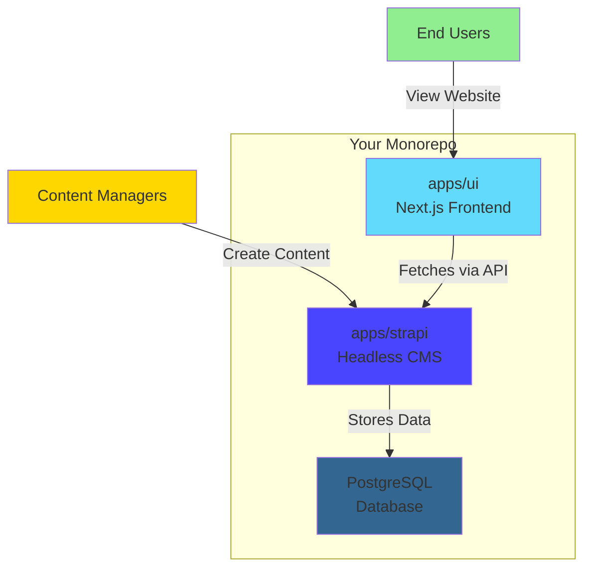
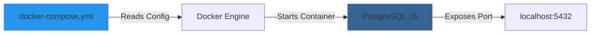
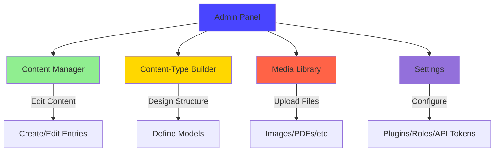
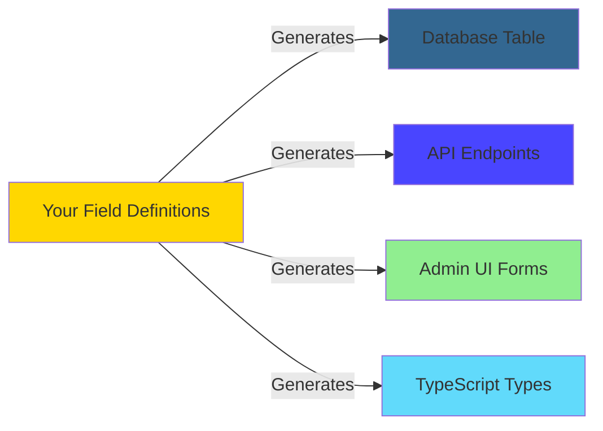
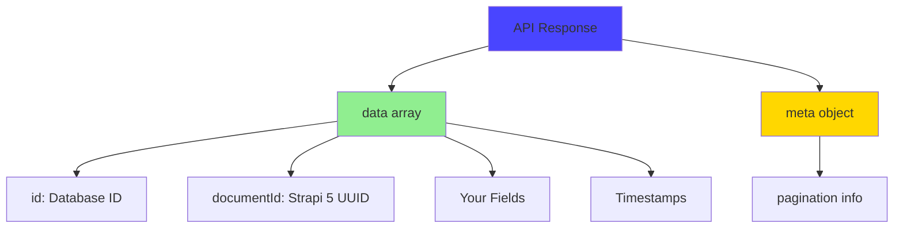
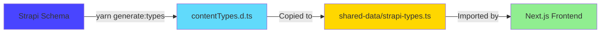

# 🟢 Strapi 5 - Beginner Guide

**Level**: Entry (No prior Strapi experience required)  
**Time**: 45 minutes  
**Goal**: Set up Strapi 5, create your first content type, understand the admin panel

---

## 📖 What You'll Learn

By the end of this guide, you'll be able to:

✅ Set up Strapi 5 with PostgreSQL locally  
✅ Navigate the Strapi admin panel confidently  
✅ Create content types (the foundation of everything)  
✅ Understand the API Strapi generates automatically  
✅ Make your first API call and see real data  
✅ Grasp the monorepo structure (where Strapi fits)

---

## 🎯 The Problem We're Solving

**Scenario**: You need a content management system (CMS) that:

- Gives non-technical users a nice admin panel
- Automatically generates APIs (no manual endpoint writing)
- Lets developers control the data structure
- Works seamlessly with modern frontends (React, Next.js, etc.)

**Traditional Approach**: Build custom admin panels, write CRUD APIs manually, maintain two codebases.

**Strapi Approach**: Define content structure once → Get admin panel + API automatically → Ship faster.

---

## 🏗️ Architecture: Where Strapi Fits



**Key Concept**: Strapi is "headless" - it manages content and provides APIs, but doesn't control how your website looks. That's the frontend's job (Next.js in our case).

---

## 🚀 Part 1: First-Time Setup (15 minutes)

### Step 1: Prerequisites Check

```powershell
# Check Node.js version (need 22.x)
node --version
# Should show: v22.x.x

# Check Docker is running (for PostgreSQL)
docker --version
# Should show version info

# Check you're in the monorepo root
Get-Location
# Should end with: strapi-next-monorepo-v2
```

**Why These Matter**:

- Node 22: Strapi 5 requires modern Node features
- Docker: We run PostgreSQL in a container (clean, isolated, reproducible)
- Monorepo root: All commands expect you to start here

---

### Step 2: Install Dependencies

```powershell
# Install all monorepo dependencies
yarn

# This installs:
# - Strapi packages (CMS engine)
# - PostgreSQL driver (pg)
# - All plugins (config-sync, SEO, etc.)
# - Shared packages in the monorepo
```

**What Just Happened**:

```
Root package.json → Installs workspaces
├── apps/strapi → Strapi 5 packages
├── apps/ui → Next.js packages
└── packages/* → Shared utilities
```

**Time**: ~2-3 minutes (first time), ~30 seconds (subsequent)

---

### Step 3: Environment Configuration

```powershell
# Navigate to Strapi app
cd apps/strapi

# Copy environment template
cp .env.example .env

# Open in your editor
code .env  # or notepad .env
```

**Key Variables to Understand**:

```env
# Server Configuration
HOST=0.0.0.0              # Listen on all network interfaces
PORT=1337                 # Strapi runs here (http://localhost:1337)

# Security Secrets (CHANGE IN PRODUCTION!)
APP_KEYS=toBeModified1,toBeModified2
API_TOKEN_SALT=toBeModified
ADMIN_JWT_SECRET=toBeModified

# Database Configuration
DATABASE_CLIENT=postgres   # We use PostgreSQL (not SQLite)
DATABASE_HOST=localhost    # Database runs on your machine
DATABASE_PORT=5432         # Standard PostgreSQL port
DATABASE_NAME=strapi_db    # Database name
DATABASE_USERNAME=postgres # Database user
DATABASE_PASSWORD=postgres # Database password (change for production!)
DATABASE_SSL=false         # No SSL for local development
```

> **CTO Note**: In production, use strong random secrets. Generate with:
>
> ```powershell
> node -e "console.log(require('crypto').randomBytes(32).toString('base64'))"
> ```

**For Now**: Default values work perfectly for local development. Just save the file.

---

### Step 4: Start PostgreSQL Database

```powershell
# Still in apps/strapi directory
docker compose up -d db
```

**What This Does**:



**Verify It's Running**:

```powershell
docker ps
# Should show: postgres container running
```

**The Container Contains**:

- PostgreSQL 16 Alpine (lightweight Linux distribution)
- Empty database named `strapi_db`
- User `postgres` with password `postgres`
- Data persisted in Docker volume (survives restarts)

> **Why Docker?**:
>
> - Clean: Doesn't pollute your system
> - Reproducible: Same environment for whole team
> - Disposable: Delete and recreate anytime

---

### Step 5: Start Strapi (Development Mode)

```powershell
# Still in apps/strapi
yarn develop

# Or from monorepo root:
yarn dev:strapi
```

**First Start** (this takes ~2 minutes):

```
✔ Building admin panel...
✔ Loading Strapi...
✔ Building configuration...
✔ Starting PostgreSQL migrations...
✔ Registering plugins...
✔ Starting server...

📘 Server started successfully
┌─────────────────────────────────────────────────┐
│ Strapi is running at http://localhost:1337      │
│ Admin panel: http://localhost:1337/admin        │
└─────────────────────────────────────────────────┘
```

**What Just Happened**:

1. **Built Admin Panel**: Strapi compiles the React admin UI
2. **Database Migrations**: Created all system tables in PostgreSQL
3. **Registered Plugins**: Loaded config-sync, SEO, user-permissions, etc.
4. **Started Server**: HTTP server listening on port 1337

---

### Step 6: Create Your Admin Account

1. Open browser: `http://localhost:1337/admin`
2. First visit shows **registration form**:
   - Username: `admin` (or your name)
   - Email: `admin@example.com`
   - Password: (minimum 8 characters)
3. Click **Let's start**

**This Creates**:

- Your admin user account (stored in PostgreSQL)
- Session token (keeps you logged in)
- Default role: Super Admin (full permissions)

**You're In!** 🎉

---

## 🎨 Part 2: Understanding the Admin Panel (10 minutes)

### The Dashboard Tour



### Left Sidebar Navigation

| Section                  | Purpose                    | When You Use It                        |
| ------------------------ | -------------------------- | -------------------------------------- |
| **Content Manager**      | Create/edit actual content | Daily - adding blog posts, pages, etc. |
| **Content-Type Builder** | Design data structures     | Weekly - creating new content types    |
| **Media Library**        | Manage uploaded files      | Daily - adding images, PDFs            |
| **Plugins**              | Extend functionality       | Rarely - configuring SEO, email, etc.  |
| **Settings**             | Configure Strapi           | Rarely - API tokens, user roles, etc.  |

**Mental Model**:

- **Content-Type Builder** = Database schema designer (for devs)
- **Content Manager** = WordPress-style editor (for content teams)

---

## 📝 Part 3: Creating Your First Content Type (15 minutes)

### Scenario: Building a Blog

Let's create a simple blog post content type.

### Step 1: Open Content-Type Builder

1. Left sidebar → **Content-Type Builder**
2. Click **+ Create new collection type**

**Collection Type vs Single Type**:

- **Collection**: Many items (blog posts, products, team members)
- **Single**: One item (homepage, about page, site settings)

We're building a blog with many posts → **Collection Type**

---

### Step 2: Name Your Content Type

**Display Name**: `Blog Post`  
**API ID (singular)**: `blog-post` (auto-filled)  
**API ID (plural)**: `blog-posts` (auto-filled)

**What This Means**:

```
Display Name → What humans see in admin panel
API ID (singular) → blog-post (used in code/URLs)
API ID (plural) → blog-posts (API endpoint: /api/blog-posts)
```

Click **Continue**

---

### Step 3: Add Fields

Now design what data each blog post contains.

#### Field 1: Title (Text)

```
Field Name: title
Type: Short text
Required: Yes (✓)
Unique: No
```

Click **Add another field**

#### Field 2: Content (Rich Text)

```
Field Name: content
Type: Rich text (allows formatting, links, images)
Required: Yes (✓)
```

Click **Add another field**

#### Field 3: Featured Image (Media)

```
Field Name: featuredImage
Type: Media
Allowed types: Images only
Multiple: No (single image)
Required: No
```

Click **Add another field**

#### Field 4: Published Date (Date)

```
Field Name: publishedAt
Type: Date
Type: Date & Time
Required: Yes (✓)
```

Click **Add another field**

#### Field 5: Author (Text)

```
Field Name: author
Type: Short text
Required: Yes (✓)
Default value: "Admin"
```

---

### Step 4: Save and Observe

Click **Save** (top right)

**Strapi is now**:



Wait for server restart (~10 seconds).

**What Just Happened**:

1. **Database Migration**: Created `blog_posts` table in PostgreSQL
2. **API Generated**: `GET /api/blog-posts`, `POST /api/blog-posts`, etc.
3. **Admin UI Generated**: Forms to create/edit blog posts
4. **Types Generated**: `apps/strapi/types/generated/contentTypes.d.ts`

---

### Step 5: Create Your First Entry

1. Left sidebar → **Content Manager**
2. Expand **Collection Types** → Click **Blog Post**
3. Click **+ Create new entry**

**Fill in the form**:

```
Title: My First Blog Post
Content: <rich text editor>
  Welcome to my blog! This is my first post created in Strapi 5.

  Features I love:
  - Auto-generated APIs
  - Clean admin panel
  - Type safety with TypeScript

Featured Image: <Upload an image or skip for now>
Published At: <Pick today's date and time>
Author: Admin
```

Click **Save** (top right)

**Entry States**:

- **Draft**: Saved but not published (not visible in API)
- **Published**: Visible in API responses

Click **Publish** → Confirm

---

## 🔌 Part 4: Consuming the API (10 minutes)

### Understanding Strapi's Generated API

**Base URL**: `http://localhost:1337`  
**Blog Posts Endpoint**: `/api/blog-posts`

---

### Step 1: Enable Public Access (For Testing)

By default, APIs are protected. Let's temporarily make blog posts public:

1. **Settings** → **Users & Permissions Plugin** → **Roles**
2. Click **Public**
3. Expand **Blog-post**
4. Check ✓ **find** and **findOne**
5. Click **Save**

**What This Does**: Allows unauthenticated requests to fetch blog posts (read-only)

> **Production Note**: In real apps, use API tokens or authenticated requests. Public access is just for learning.

---

### Step 2: Make Your First API Call

**Option 1: Browser** (simplest)

Just visit in browser:

```
http://localhost:1337/api/blog-posts
```

**Option 2: PowerShell** (more powerful)

```powershell
# Fetch all blog posts
curl http://localhost:1337/api/blog-posts | ConvertFrom-Json | ConvertTo-Json -Depth 10

# Or using Invoke-RestMethod (prettier)
Invoke-RestMethod -Uri "http://localhost:1337/api/blog-posts" -Method GET | ConvertTo-Json -Depth 10
```

**Option 3: Postman/Insomnia** (recommended for serious API testing)

```http
GET http://localhost:1337/api/blog-posts
```

---

### Step 3: Understanding the Response

```json
{
  "data": [
    {
      "id": 1,
      "documentId": "abc123def456",
      "title": "My First Blog Post",
      "content": "Welcome to my blog!...",
      "featuredImage": null,
      "publishedAt": "2025-12-01T10:30:00.000Z",
      "author": "Admin",
      "createdAt": "2025-12-01T10:25:00.000Z",
      "updatedAt": "2025-12-01T10:30:00.000Z",
      "publishedAt": "2025-12-01T10:30:00.000Z",
      "locale": null
    }
  ],
  "meta": {
    "pagination": {
      "page": 1,
      "pageSize": 25,
      "pageCount": 1,
      "total": 1
    }
  }
}
```

**Response Structure**:



**Key Fields**:

- `id`: Numeric database ID (still exists for compatibility)
- `documentId`: Strapi 5's new unique identifier (use this!)
- `createdAt`, `updatedAt`, `publishedAt`: Automatic timestamps
- Your custom fields: `title`, `content`, `author`, etc.

---

### Step 4: Fetching a Single Entry

```http
GET http://localhost:1337/api/blog-posts/<documentId>
```

Replace `<documentId>` with the actual documentId from previous response:

```powershell
# Example with actual documentId
Invoke-RestMethod -Uri "http://localhost:1337/api/blog-posts/abc123def456" | ConvertTo-Json -Depth 10
```

**Response**: Same structure but `data` is an object (not array)

---

### Step 5: Query Parameters

Strapi APIs support filtering, sorting, pagination out of the box:

```http
# Get only published posts
GET /api/blog-posts?filters[publishedAt][$notNull]=true

# Sort by date (newest first)
GET /api/blog-posts?sort=publishedAt:desc

# Pagination
GET /api/blog-posts?pagination[page]=1&pagination[pageSize]=10

# Search by title
GET /api/blog-posts?filters[title][$contains]=First

# Combine filters
GET /api/blog-posts?filters[author][$eq]=Admin&sort=publishedAt:desc
```

**PowerShell Example**:

```powershell
$uri = "http://localhost:1337/api/blog-posts?sort=publishedAt:desc"
Invoke-RestMethod -Uri $uri | ConvertTo-Json -Depth 10
```

**No Code Written**: All this functionality is auto-generated by Strapi!

---

## 🧩 Part 5: Understanding the Monorepo Structure (5 minutes)

### Where Is Everything?

```
strapi-next-monorepo-v2/
├── apps/
│   ├── strapi/                    ← YOU ARE HERE
│   │   ├── config/                # Strapi configuration
│   │   │   ├── admin.ts           # Admin panel settings
│   │   │   ├── api.ts             # API settings
│   │   │   ├── database.ts        # Database connection
│   │   │   ├── middlewares.ts     # Security, CORS, etc.
│   │   │   ├── plugins.ts         # Plugin configuration
│   │   │   └── server.ts          # Server settings
│   │   ├── database/              # SQLite database (if used)
│   │   ├── public/                # Public assets
│   │   │   └── uploads/           # User-uploaded media
│   │   ├── src/
│   │   │   ├── api/               # Your APIs (content types)
│   │   │   │   └── blog-post/     # Blog post content type
│   │   │   │       ├── content-types/
│   │   │   │       │   └── blog-post/
│   │   │   │       │       └── schema.json  # Field definitions
│   │   │   │       ├── controllers/  # Custom logic
│   │   │   │       ├── routes/       # Custom routes
│   │   │   │       └── services/     # Custom services
│   │   │   ├── components/        # Reusable field groups
│   │   │   └── extensions/        # Extend Strapi core
│   │   ├── types/
│   │   │   └── generated/         # Auto-generated TypeScript types
│   │   │       ├── contentTypes.d.ts  # Your content types
│   │   │       └── components.d.ts    # Your components
│   │   ├── .env                   # Environment variables
│   │   ├── docker-compose.yml     # PostgreSQL container
│   │   └── package.json           # Dependencies
│   │
│   └── ui/                        # Next.js frontend (separate article)
│
└── packages/
    └── shared-data/               # Shared types between apps
        └── strapi-types.ts        # Exported Strapi types
```

---

### How Frontend Consumes Backend Types



**Type Safety Flow**:

1. You define content types in Strapi
2. Strapi generates TypeScript definitions
3. Shared package exports types
4. Frontend imports types
5. **Result**: Type-safe API calls (TypeScript catches errors before runtime)

**Example**:

```typescript
// In Next.js frontend
import type { BlogPost } from "@repo/shared-data/strapi-types"

// TypeScript knows the shape of blog posts!
const post: BlogPost = await fetch("/api/blog-posts/1")
// post.title ✓ (known)
// post.invalidField ✗ (TypeScript error)
```

---

## 🎯 Beginner Certification Checklist

You've completed the beginner level if you can:

- [ ] Start Strapi and PostgreSQL locally
- [ ] Navigate the admin panel confidently
- [ ] Create a collection type with 5+ fields
- [ ] Add/edit/publish content entries
- [ ] Make API calls and understand responses
- [ ] Explain the difference between collection and single types
- [ ] Know where content types are defined (`src/api/*/content-types/`)
- [ ] Understand the monorepo structure (where Strapi fits)

---

## 💡 Key Concepts Review

### 1. Headless CMS

Strapi manages content and provides APIs. It doesn't control your website's appearance (that's Next.js).

### 2. Content Types = Database Tables

When you create a content type, Strapi:

- Creates database table
- Generates CRUD APIs
- Generates admin UI
- Generates TypeScript types

### 3. Auto-Generated APIs

```
Content Type "Blog Post" → Automatic endpoints:
GET    /api/blog-posts       (list all)
GET    /api/blog-posts/:id   (get one)
POST   /api/blog-posts       (create)
PUT    /api/blog-posts/:id   (update)
DELETE /api/blog-posts/:id   (delete)
```

### 4. Docker for PostgreSQL

Clean, reproducible, isolated database environment. Team shares same setup.

### 5. TypeScript Type Generation

Changes in Strapi automatically update TypeScript types. Frontend stays in sync.

---

## 🚀 Next Steps

**You're Ready For**:

- [Strapi 5 Intermediate](/docs/14-deep-dives-strapi-5-02-intermediate) - Dynamic zones, populate middleware, config sync
- Creating more complex content types (relations, components)
- Understanding Strapi plugins (SEO, user-permissions, etc.)

**Try This Exercise** (15 minutes):

1. Create a `Team Member` collection type
2. Fields: `name` (text), `role` (text), `bio` (rich text), `photo` (media), `joinedAt` (date)
3. Add 3 team members
4. Fetch via API
5. Try filtering by role: `/api/team-members?filters[role][$eq]=Developer`

---

## 🐛 Common Beginner Issues

### Issue 1: "Port 1337 already in use"

**Cause**: Strapi is already running (maybe from previous session)

**Fix**:

```powershell
# Find process using port 1337
netstat -ano | findstr :1337

# Kill process by PID
taskkill /PID <PID> /F

# Or restart your computer (nuclear option)
```

---

### Issue 2: "Cannot connect to database"

**Cause**: PostgreSQL container isn't running

**Fix**:

```powershell
cd apps/strapi
docker compose up -d db

# Verify it's running
docker ps
```

---

### Issue 3: "403 Forbidden" when calling API

**Cause**: Endpoint isn't public

**Fix**: Settings → Users & Permissions → Public → Enable `find` and `findOne` for your content type

---

### Issue 4: Admin panel shows blank screen

**Cause**: Admin build failed or cache issue

**Fix**:

```powershell
# Clear Strapi cache
cd apps/strapi
rm -rf .strapi
rm -rf build

# Rebuild
yarn develop
```

---

## 📚 Additional Resources

**Official Docs**:

- [Strapi 5 Documentation](https://docs.strapi.io/)
- [Content-Type Builder](https://docs.strapi.io/user-docs/content-type-builder)
- [REST API](https://docs.strapi.io/dev-docs/api/rest)

**Our Monorepo Docs**:

- [Strapi README](/docs/readme) - App-specific documentation
- [Component Workflow](/docs/04-components-workflow) - How we build features
- [Config Sync](../../03-strapi/config-sync/) - Team collaboration

**Video Tutorials**:

- [Strapi Crash Course](https://www.youtube.com/strapi) - Official YouTube channel

---

## 🎓 What You've Accomplished

**Technical Skills**:
✅ Set up production-grade CMS locally  
✅ Designed data structures without SQL  
✅ Consumed auto-generated RESTful APIs  
✅ Understood headless CMS architecture  
✅ Worked with Docker containers

**Strategic Understanding**:
✅ Why headless CMS vs traditional WordPress  
✅ How type-safe APIs prevent bugs  
✅ Why Docker containers improve team collaboration  
✅ How Strapi accelerates development (no manual API writing)

**Time Saved**:

- Traditional approach: 8 hours (build admin panel + write CRUD APIs)
- Strapi approach: 45 minutes (this tutorial)
- **Saved**: 7+ hours per content type

**You're now ready for intermediate topics!** 🎉

---

**Next**: [Strapi 5 Intermediate](/docs/14-deep-dives-strapi-5-02-intermediate) - Dynamic zones, populate middleware, and team workflows

---

**Last Updated**: December 1, 2025  
**Article**: Strapi 5 Beginner Guide  
**Part of**: [Deep Dives - Technical Mastery](/docs/14-deep-dives-readme)
