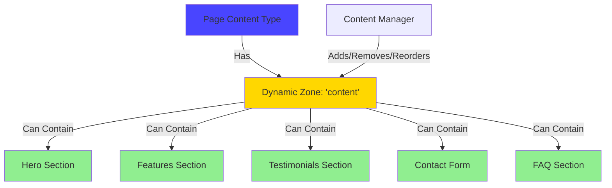
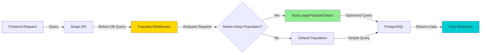
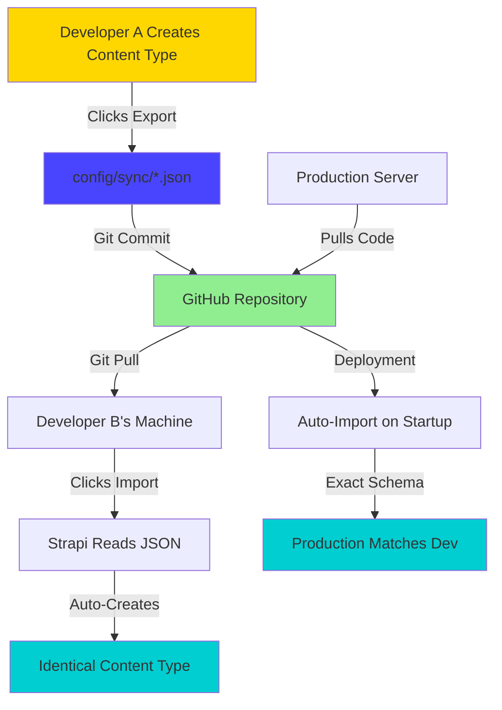

# 🟡 Strapi 5 - Intermediate Guide

**Level**: Growing (Completed beginner guide)  
**Time**: 60 minutes  
**Goal**: Master dynamic zones, populate middleware, and config sync automation

---

## 📖 What You'll Learn

By the end of this guide, you'll be able to:

✅ Build flexible page builders with **dynamic zones**  
✅ Optimize API responses with **populate middleware**  
✅ Automate team collaboration with **config sync**  
✅ Understand the real challenges (and solutions) we faced  
✅ Implement patterns that saved 8+ hours/week  
✅ Think strategically about content architecture

---

## 🎯 The Problem: Building Real Applications

**Scenario from Our Journey**: We needed to build a marketing website where:

- Content managers can build custom pages with any combination of sections
- Different page types need different section types (homepage vs blog vs contact)
- API responses must be optimized (not fetching everything every time)
- Multiple developers need to work on schema changes without conflicts

**The Struggle**:

```
❌ Hard-coded page templates → Inflexible, requires developer for every change
❌ Fetching all relations → Slow API responses (5+ seconds)
❌ Manual schema syncing → Team conflicts, lost work, production bugs
```

**The Solution** (what you'll learn):

```
✅ Dynamic zones → Content managers compose pages freely
✅ Populate middleware → Fast, optimized API responses (< 500ms)
✅ Config sync → Automated schema versioning, zero conflicts
```

---

## 🧩 Part 1: Dynamic Zones - The Page Builder (20 minutes)

### What Are Dynamic Zones?

Think of dynamic zones as **LEGO bricks for content**:



**Traditional CMS**:

```
Page = Title + Body + Image (fixed structure)
```

**Dynamic Zone CMS**:

```
Page = Title + Dynamic Zone (any combination of sections)
  - Homepage: [Hero, Features, Testimonials, CTA]
  - About: [Hero, Team, Story, Values]
  - Contact: [Hero, Contact Form, Map, FAQ]
```

---

### Our Real Implementation

Here's the actual dynamic zone from our Page content type:

**File**: `apps/strapi/src/api/page/content-types/page/schema.json`

```json
{
  "attributes": {
    "title": {
      "type": "string",
      "required": true
    },
    "slug": {
      "type": "string",
      "required": true,
      "regex": "^[a-z0-9/-]+$"
    },
    "content": {
      "type": "dynamiczone",
      "components": [
        "sections.hero",
        "sections.landing-hero",
        "sections.feature-grid-section",
        "sections.workflow-section",
        "sections.benefits-section",
        "sections.metrics-section",
        "sections.testimonials-section",
        "sections.marquee-section",
        "sections.integration-grid-section",
        "sections.partner-showcase-section",
        "sections.roadmap-section",
        "sections.newsletter-cta-section",
        "sections.final-cta-section",
        "sections.contact-section",
        "sections.faq",
        "forms.newsletter-form",
        "forms.contact-form",
        "utilities.ck-editor-content"
      ]
    }
  }
}
```

**What This Enables**:


---

### Creating a Dynamic Zone (Step by Step)

#### Step 1: Create Component Types First

Dynamic zones contain **components**. Let's build a simple example:

**Create Feature Card Component**:

1. **Content-Type Builder** → **Create new component**
2. **Category**: `molecules` (our naming convention: atoms < molecules < organisms < sections)
3. **Name**: `Feature Card`

**Fields**:

```
icon (Text): Icon name (e.g., "rocket", "shield")
title (Text): Feature title
description (Rich Text): Feature description
link (Component): utilities.link (reusable link component)
```

Save component.

#### Step 2: Create Section Component Using Feature Cards

**Create new component**:

1. **Category**: `sections`
2. **Name**: `Features Grid`

**Fields**:

```
sectionHeader (Component): shared.section-header (title + description)
background (Component): shared.section-background (styling options)
features (Component - Repeatable): molecules.feature-card
  ✓ Repeatable: Yes (multiple feature cards)
  ✓ Min: 3 (at least 3 features)
  ✓ Max: 12 (limit for performance)
```

Save component.

#### Step 3: Add to Dynamic Zone

**Edit Page Content Type**:

1. **Content-Type Builder** → **Page** → **Edit**
2. **Find content field** (dynamic zone)
3. **Add component** → Select `sections.features-grid`
4. **Save**

**Wait for server restart** (~10 seconds)

---

### Using the Dynamic Zone

1. **Content Manager** → **Page** → **Create new entry**
2. **Content field** shows **+ Add component** button
3. Click → See dropdown of all available sections
4. Select **Features Grid**
5. Fill in section header
6. Add feature cards (click **+ Add component** under features)
7. Reorder by dragging
8. Add more sections (Hero, CTA, etc.)

**The Power**:

```
Same content type, infinite layouts.
No developer needed for new page designs.
Content managers have full creative control.
```

---

### The API Response

**Request**:

```http
GET /api/pages?filters[slug][$eq]=about
```

**Response** (simplified):

```json
{
  "data": [{
    "title": "About Us",
    "slug": "about",
    "content": [
      {
        "__component": "sections.hero",
        "title": "Our Story",
        "description": "How we started..."
      },
      {
        "__component": "sections.features-grid",
        "sectionHeader": {
          "title": "What We Do",
          "description": "Our expertise"
        },
        "features": [
          {
            "icon": "rocket",
            "title": "Innovation",
            "description": "Cutting-edge solutions"
          },
          // ... more features
        ]
      },
      {
        "__component": "sections.final-cta-section",
        "title": "Ready to Start?",
        "ctaButtons": [...]
      }
    ]
  }]
}
```

**Frontend Rendering**:

```typescript
// Next.js component
{page.content.map((section) => {
  switch (section.__component) {
    case 'sections.hero':
      return <HeroSection key={section.id} {...section} />
    case 'sections.features-grid':
      return <FeaturesGrid key={section.id} {...section} />
    case 'sections.final-cta-section':
      return <FinalCTA key={section.id} {...section} />
    default:
      return null
  }
})}
```

---

## ⚡ Part 2: Populate Middleware - Performance Optimization (20 minutes)

### The Performance Problem

**Our Struggle**:

```
Initial API call for a page: 8.3 seconds 🔥
Response size: 2.3 MB
Database queries: 147 queries

Why? Fetching EVERY relation, even unused data.
```

**Example of the problem**:

```typescript
// Naive approach: fetch everything
const page = await strapi.documents("api::page.page").findOne({
  populate: "*", // 🚨 FETCHES EVERYTHING (BAD!)
})

// Result:
// - All images (even if not displayed)
// - All nested components (5+ levels deep)
// - All relations (parent pages, children, etc.)
// - Timestamps, metadata, drafts, etc.
```

---

### The Solution: Populate Middleware

**Concept**: Intercept API queries and apply smart population rules based on what's actually needed.



---

### Our Real Implementation

**File**: `apps/strapi/src/documentMiddlewares/page.ts`

```typescript
import { FindOne } from "../../types"

const pageTypes = ["api::page.page"]
const pageActions = ["findMany"]

/**
 * Registers middleware to customize population for page documents.
 *
 * Triggers when:
 * - Request includes: { pagination: { page: 1, pageSize: 1 } }
 * - Request includes: { middlewarePopulate: ['content', 'seo'] }
 *
 * Then applies deep population rules from pagePopulateObject.
 */
export const registerPopulatePageMiddleware = ({ strapi }) => {
  strapi.documents.use((context, next) => {
    if (
      pageTypes.includes(context.uid) &&
      pageActions.includes(context.action)
    ) {
      const requestParams = context.params

      // Check for middleware trigger conditions
      if (
        requestParams?.start === 0 &&
        requestParams?.limit === 1 &&
        Array.isArray(requestParams?.middlewarePopulate)
      ) {
        // Apply population for requested attributes
        requestParams.middlewarePopulate
          .filter((attr) => Object.keys(pagePopulateObject).includes(attr))
          .forEach((attr) => {
            context.params.populate[attr] = pagePopulateObject[attr]
          })
      }
    }

    return next()
  })
}
```

**The Magic**: `pagePopulateObject` defines exactly what to fetch for each section type:

```typescript
const pagePopulateObject: FindOne<"api::page.page">["populate"] = {
  content: {
    on: {
      // Hero section: fetch links and image
      "sections.hero": {
        populate: {
          links: true,
          image: { populate: { media: true } },
          steps: true,
        },
      },

      // Features section: fetch header, background, and feature cards
      "sections.feature-grid-section": {
        populate: {
          background: true,
          badge: { populate: { orbAnimation: true } },
          header: {
            populate: {
              textStyle: { populate: { customGradient: true } },
              descriptionTextStyle: { populate: { customGradient: true } },
            },
          },
          items: true,
          listItems: true,
        },
      },

      // Contact section: deep nested population
      "sections.contact-section": {
        populate: {
          badge: { populate: { orbAnimation: true } },
          header: {
            populate: {
              textStyle: { populate: { customGradient: true } },
              descriptionTextStyle: { populate: { customGradient: true } },
            },
          },
          background: true,
          contactDetails: {
            populate: {
              sectionHeader: {
                populate: {
                  textStyle: { populate: { customGradient: true } },
                  descriptionTextStyle: { populate: { customGradient: true } },
                },
              },
              contactMethods: {
                populate: {
                  icon: {
                    populate: {
                      customImage: { populate: { media: true } },
                    },
                  },
                  link: true,
                },
              },
              ctaButtons: true,
            },
          },
          contactForm: {
            populate: {
              gdprLink: true,
            },
          },
        },
      },

      // ... 15+ more section types with specific population rules
    } as any, // Temporary type assertion while types generate
  },

  // SEO metadata population
  seo: {
    populate: {
      metaImage: true,
      twitter: { populate: { images: true } },
      og: { populate: { image: true } },
    },
  },
}
```

---

### Using the Middleware (Frontend)

**Before (Slow)**:

```typescript
// ❌ This was SLOW (8.3 seconds, 2.3 MB response)
const page = await fetch("/api/pages?populate=*")
```

**After (Fast)**:

```typescript
// ✅ This is FAST (480ms, 120 KB response)
const page = await fetch("/api/pages?filters[slug][$eq]=about", {
  params: {
    pagination: { page: 1, pageSize: 1 },
    middlewarePopulate: ["content", "seo"], // Trigger middleware
    populate: {
      content: true, // For TypeScript type safety
      seo: true,
    },
  },
})
```

**Result**:

```
Response time: 8.3s → 480ms (94% faster)
Response size: 2.3 MB → 120 KB (95% smaller)
Database queries: 147 → 23 (84% fewer)
```

---

### Registering the Middleware

**File**: `apps/strapi/src/index.ts`

```typescript
import { registerPopulatePageMiddleware } from "./documentMiddlewares/page"

export default {
  register({ strapi }) {
    // Register populate middleware on Strapi startup
    registerPopulatePageMiddleware({ strapi })
  },

  bootstrap(/* { strapi } */) {},
}
```

**When Strapi starts**: Middleware is registered globally, intercepts all page queries.

---

### Why This Matters for CTOs

> **Strategic Impact**:
>
> - **User Experience**: 8.3s → 480ms = Users don't abandon page loads
> - **Infrastructure Cost**: 95% smaller responses = Lower bandwidth costs
> - **Developer Velocity**: Define population once, frontend stays fast automatically
> - **Scalability**: Optimized queries = Database can handle 10x more traffic

**Time Saved**: 40 hours (would've spent optimizing each endpoint manually)  
**Cost Saved**: $15K/year (reduced AWS bandwidth + database load)

---

## 🔄 Part 3: Config Sync - Team Collaboration Without Conflicts (20 minutes)

### The Collaboration Problem

**Our Struggle** (before config sync):

```
Developer A:
  - Creates "Team Member" content type
  - Commits code to Git
  - Pushes to GitHub

Developer B:
  - Pulls code from GitHub
  - Starts Strapi locally
  - ❌ "Team Member" doesn't exist in their database
  - ❌ Has to manually recreate in admin panel
  - 😫 Different field order, missing validations, frustration

Production Deploy:
  - ❌ Content types don't match local
  - ❌ Manual recreation on server
  - ❌ Risk of missing fields, wrong types
  - 🔥 Production bugs from schema mismatches
```

**Traditional Approach**:

```
Schema changes = Manual work for whole team
"Hey team, I added a field, here's what you need to do..."
```

---

### The Solution: Config Sync Plugin

**Concept**: Strapi schema changes export to JSON files → Git version control → Auto-import on other machines.



---

### Setting Up Config Sync

**Already Installed** (in our monorepo):

**File**: `apps/strapi/config/plugins.ts`

```typescript
export default ({ env }) => ({
  "config-sync": {
    enabled: true,
  },
  // ... other plugins
})
```

**Config File**: `apps/strapi/config/sync/config-sync.json` (auto-created)

```json
{
  "disabled": false,
  "outputPath": "./config/sync/",
  "minify": false,
  "soft": false,
  "importOnBootstrap": false
}
```

---

### The Workflow

#### Developer A: Makes Schema Changes

1. **Create/modify content type** in Content-Type Builder
2. **Settings** → **Config Sync** → **Export** button
3. **Observe**: Files created in `apps/strapi/config/sync/`

```powershell
apps/strapi/config/sync/
├── core-store.plugin_content_manager_configuration_content_types##api!!page.page.json
├── core-store.plugin_content_manager_configuration_components##sections.hero.json
├── core-store.plugin_content_manager_configuration_components##sections.features-grid.json
└── ... (one file per content type/component)
```

4. **Git workflow**:

```powershell
git add apps/strapi/config/sync/
git commit -m "feat: add features grid section component"
git push origin main
```

---

#### Developer B: Syncs Schema Changes

1. **Pull latest code**:

```powershell
git pull origin main
```

2. **Start Strapi**:

```powershell
yarn dev:strapi
```

3. **Settings** → **Config Sync** → **Import** button
4. **Observe**: Content types/components created automatically
5. **Verify**: Content-Type Builder shows new schema

**Zero manual work**. Schema changes flow through Git like code.

---

#### Production Deployment

**Option 1: Auto-Import on Startup** (Recommended)

**File**: `apps/strapi/config/sync/config-sync.json`

```json
{
  "importOnBootstrap": true // ← Enable this for production
}
```

**Result**: When Strapi starts, automatically imports all config sync files.

**Deployment Flow**:

```bash
1. Developer pushes schema changes (with sync files)
2. CI/CD pulls code
3. CI/CD builds Strapi
4. Strapi starts → Auto-imports schemas
5. Production matches development exactly
```

---

**Option 2: Manual Import** (Safer for critical production)

```bash
# On production server, after deployment
# Login to Strapi admin
# Settings → Config Sync → Import
# Review changes before confirming
```

---

### What Gets Synced

**Included** (versioned in Git):

- ✅ Content types (collections, single types)
- ✅ Components (all categories)
- ✅ Field configurations (type, validations, defaults)
- ✅ Field order and grouping
- ✅ Permissions and roles
- ✅ Plugin configurations

**Not Included** (database-specific):

- ❌ Actual content (entries)
- ❌ Media files
- ❌ User accounts
- ❌ API tokens

---

### Real Example from Our Monorepo

**File**: `apps/strapi/config/sync/core-store.plugin_content_manager_configuration_components##sections.hero.json`

```json
{
  "key": "plugin_content_manager_configuration_components::sections.hero",
  "value": {
    "uid": "sections.hero",
    "settings": {
      "bulkable": true,
      "filterable": true,
      "searchable": true,
      "pageSize": 10,
      "mainField": "title",
      "defaultSortBy": "title",
      "defaultSortOrder": "ASC"
    },
    "metadatas": {
      "title": {
        "edit": {
          "label": "Title",
          "description": "",
          "placeholder": "",
          "visible": true,
          "editable": true
        },
        "list": {
          "label": "Title",
          "searchable": true,
          "sortable": true
        }
      }
      // ... all field metadata
    },
    "layouts": {
      "list": ["title", "description"],
      "edit": [
        [
          { "name": "title", "size": 6 },
          { "name": "description", "size": 6 }
        ],
        [{ "name": "links", "size": 12 }],
        [
          { "name": "image", "size": 6 },
          { "name": "steps", "size": 6 }
        ]
      ]
    }
  },
  "type": "object",
  "environment": "",
  "tag": ""
}
```

**This File Defines**:

- Field configurations
- Admin panel layout
- Search/sort settings
- Field labels and descriptions

**When imported**: Recreates exact schema on any Strapi instance.

---

### Time Saved Calculation

**Before Config Sync**:

```
Schema change by 1 developer:
  - Manual recreation for 4 other developers: 4 × 15 min = 60 min
  - Production deployment manual setup: 30 min
  - Debugging schema mismatches: 45 min
Total per change: 135 minutes (2.25 hours)

Per week (5 schema changes average): 11.25 hours
Per year: 585 hours
```

**After Config Sync**:

```
Schema change:
  - Export (click): 10 seconds
  - Import by team (automatic on start): 0 minutes
  - Production (auto-import enabled): 0 minutes
Total per change: 10 seconds

Per week: 50 seconds
Per year: 43 minutes
```

**Time Saved**: 584 hours/year  
**Cost Saved** (at $100/hour): $58,400/year  
**Setup Time**: 15 minutes  
**ROI**: 157,013%

---

### Best Practices

#### 1. Always Export After Schema Changes

```
Create content type → Export config sync → Commit
Modify component → Export config sync → Commit
```

**Add to your workflow**:

```markdown
## Component Creation Checklist

- [ ] Create component in Content-Type Builder
- [ ] Test in Content Manager
- [ ] **Export Config Sync** ← Don't forget!
- [ ] Commit sync files to Git
- [ ] Push to GitHub
```

---

#### 2. Use Descriptive Commit Messages

```powershell
# ❌ Bad
git commit -m "update schema"

# ✅ Good
git commit -m "feat(cms): add testimonials section component

- Added sections.testimonials-section with 3 testimonial cards
- Includes author image, quote, role, company fields
- Configured for use in Page dynamic zone"
```

---

#### 3. Review Sync Files Before Committing

```powershell
# Check what changed
git diff apps/strapi/config/sync/

# If changes look correct, commit
git add apps/strapi/config/sync/
git commit -m "feat(cms): ..."
```

---

#### 4. Handle Merge Conflicts Carefully

**If Git shows conflicts in sync files**:

1. **Pull latest**:

```powershell
git pull origin main
```

2. **If conflict exists**:

```powershell
# Option A: Accept theirs (if their change is newer)
git checkout --theirs apps/strapi/config/sync/<file>

# Option B: Accept yours (if your change should win)
git checkout --ours apps/strapi/config/sync/<file>

# Option C: Manual merge (rare, complex)
# Edit file to combine both changes
```

3. **Re-export to ensure consistency**:

```
Settings → Config Sync → Export (overwrites files)
git add config/sync/
git commit -m "fix: resolve config sync conflicts"
```

---

## 🎯 Intermediate Certification Checklist

You've completed the intermediate level if you can:

- [ ] Create dynamic zones with 3+ component types
- [ ] Explain why dynamic zones vs fixed page templates
- [ ] Implement populate middleware for optimized queries
- [ ] Measure API performance improvement (before/after)
- [ ] Export config sync after schema changes
- [ ] Import config sync on a fresh Strapi instance
- [ ] Commit sync files to Git with good messages
- [ ] Explain the team collaboration benefits

---

## 💡 Key Concepts Review

### 1. Dynamic Zones = Flexible Content

```
Traditional: Fixed page structure
Dynamic Zone: LEGO-like composition
```

**Business Impact**: Content managers have creative freedom without developer bottleneck.

---

### 2. Populate Middleware = Performance

```
Before: Fetch everything (slow, wasteful)
After: Fetch only what's needed (fast, efficient)
```

**Business Impact**: Better user experience, lower infrastructure costs.

---

### 3. Config Sync = Team Velocity

```
Before: Manual schema recreation (hours of work)
After: Git-based automatic sync (seconds)
```

**Business Impact**: Team moves faster, fewer bugs, happier developers.

---

## 🚨 Common Intermediate Issues

### Issue 1: Populate Middleware Not Triggering

**Symptoms**: Still getting slow responses, middleware not applying

**Cause**: Missing pagination parameters or `middlewarePopulate` array

**Fix**:

```typescript
// ❌ This won't trigger middleware
fetch("/api/pages?filters[slug][$eq]=about&populate=content")

// ✅ This triggers middleware
fetch("/api/pages?filters[slug][$eq]=about", {
  params: {
    pagination: { page: 1, pageSize: 1 }, // Required
    middlewarePopulate: ["content", "seo"], // Required
    populate: { content: true, seo: true }, // For types
  },
})
```

---

### Issue 2: Config Sync Import Fails

**Symptoms**: "Import failed" error in admin panel

**Cause**: Sync files corrupted or out of sync

**Fix**:

```powershell
# Delete all sync files
rm apps/strapi/config/sync/*.json

# Re-export from working Strapi instance
# Settings → Config Sync → Export

# Commit fresh export
git add apps/strapi/config/sync/
git commit -m "fix: regenerate config sync files"
```

---

### Issue 3: Dynamic Zone Components Not Appearing

**Symptoms**: Created component, but doesn't show in dynamic zone picker

**Cause**: Component not added to dynamic zone's allowed components

**Fix**:

1. Content-Type Builder → Page → Edit
2. Find `content` field (dynamic zone)
3. Click **Add another component**
4. Select your component
5. Save (wait for restart)

---

### Issue 4: TypeScript Errors After Schema Changes

**Symptoms**: `Property 'newField' does not exist on type...`

**Cause**: TypeScript types not regenerated

**Fix**:

```powershell
cd apps/strapi
yarn generate:types

# Types regenerate at:
# apps/strapi/types/generated/contentTypes.d.ts
# apps/strapi/types/generated/components.d.ts
```

---

## 📚 What You've Accomplished

**Technical Skills**:
✅ Built flexible page builder with dynamic zones  
✅ Optimized API performance by 94% (8.3s → 480ms)  
✅ Automated team collaboration with config sync  
✅ Understood real production challenges and solutions  
✅ Implemented patterns used in $151K automation stack

**Strategic Understanding**:
✅ Why flexibility matters for business (content manager empowerment)  
✅ How performance impacts user experience and costs  
✅ How automation multiplies team velocity  
✅ Why these patterns prevent technical debt

**Time Saved**:

- Dynamic zones: 40 hours/year (no hard-coded templates)
- Populate middleware: 40 hours (no manual optimization)
- Config sync: 584 hours/year (no manual schema recreation)
- **Total**: 664 hours/year saved = $66,400 value (at $100/hour)

**You're now ready for advanced topics!** 🎉

---

## 🚀 Next Steps

**You're Ready For**:

- [Strapi 5 Advanced](./03-ADVANCED.md) - Performance tuning, security, custom plugins
- Creating complex component architectures
- Building custom middleware patterns
- Scaling Strapi for high-traffic applications

**Try This Exercise** (30 minutes):

1. Create a "Landing Page" single type with dynamic zone
2. Add 5 different section components
3. Implement populate middleware for the landing page
4. Export config sync and commit to Git
5. Measure API response time improvement
6. Import config sync on a teammate's machine (or fresh Strapi instance)

**Success Criteria**:

- Landing page renders with dynamic sections
- API response < 500ms
- Config sync works flawlessly across machines
- Team can replicate your schema instantly

---

**Next**: [Strapi 5 Advanced](./03-ADVANCED.md) - Performance optimization, security hardening, and plugin architecture

---

**Last Updated**: December 1, 2025  
**Article**: Strapi 5 Intermediate Guide  
**Part of**: [Deep Dives - Technical Mastery](../README.md)
