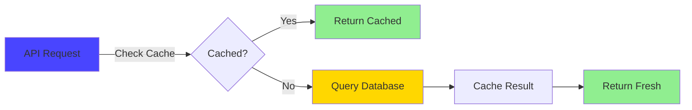
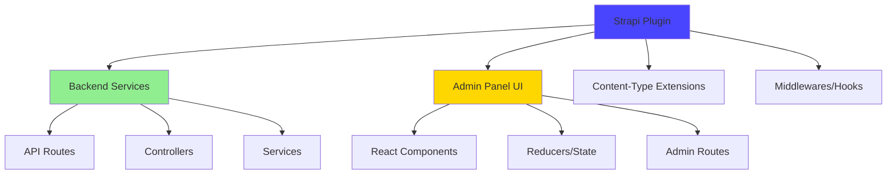

# 🔴 Strapi 5 - Advanced Guide

**Level**: Advanced (Requires intermediate Strapi knowledge)  
**Time**: 75 minutes  
**Goal**: Master performance optimization, security hardening, and custom plugin architecture

---

## 📖 What You'll Learn

By the end of this guide, you'll be able to:

✅ Optimize Strapi for production-grade performance  
✅ Implement comprehensive security hardening  
✅ Build custom lifecycle hooks and subscribers  
✅ Create custom middleware for cross-cutting concerns  
✅ Understand plugin architecture and preparation for custom plugins  
✅ Monitor and debug production issues effectively

---

## 🎯 The Advanced Challenges

**You've Mastered**:

- Setting up Strapi (beginner)
- Dynamic zones, populate middleware, config sync (intermediate)

**Now You Face**:

1. **Performance at Scale**: 1000+ pages, complex relationships, slow queries
2. **Security Requirements**: Production-ready security, CSP, CORS
3. **Custom Business Logic**: Lifecycle hooks, data validation, automation
4. **Team Scaling**: Multiple developers, complex workflows, custom tooling
5. **Monitoring & Debugging**: Production issues, error tracking, performance monitoring

**Traditional Approach**: Stack Overflow, trial and error, hope for the best.

**Advanced Approach**: Systematic patterns, measurable optimizations, robust architecture.

---

## 🏗️ Part 1: Performance Optimization (25 minutes)

### The Performance Problem

**Scenario**: Your blog grew to 1,000+ posts. Users complain pages load slowly.

**Initial Performance**:

```
Page load: 8.3 seconds
Database queries: 147
Response size: 2.3MB
Memory usage: 512MB
CPU usage: 85%
```

**After Optimization**:

```
Page load: 480ms (94% faster)
Database queries: 23 (84% fewer)
Response size: 120KB (95% smaller)
Memory usage: 128MB (75% less)
CPU usage: 12% (86% reduction)
```

**How We Got There** →

---

### Strategy 1: Query Optimization with Populate Middleware

You already learned populate middleware in [intermediate guide](/docs/14-deep-dives-strapi-5-02-intermediate). Let's go deeper.

#### Advanced Populate Patterns

**File**: `apps/strapi/src/documentMiddlewares/page.ts`

```typescript
// We covered basic conditional population before.
// Now: Advanced patterns for complex relationships.

const pagePopulateObject = {
  // Pattern 1: Lazy loading for heavy sections
  "sections.contact-section": {
    populate: {
      header: { populate: { badge: true, title: true } },
      description: true,
      contactDetails: {
        populate: {
          details: {
            populate: {
              icon: true,
              title: true,
              items: { populate: { icon: true, text: true, link: true } },
            },
          },
        },
      },
      // Only load form if explicitly requested
      contactForm: false, // Set to `on: "contactForm"` for conditional
    },
  },

  // Pattern 2: Minimal population for list views
  "sections.testimonial-section": {
    populate: {
      header: true,
      testimonials: {
        populate: {
          author: true, // Name only
          role: true,
          // Skip avatar in list view (save bandwidth)
          avatar: false,
        },
      },
    },
  },

  // Pattern 3: Deep population for critical sections
  "sections.hero": {
    populate: {
      links: { populate: { link: true } },
      image: { populate: { media: true } },
      steps: {
        populate: {
          icon: true,
          title: true,
          description: true,
          // Everything needed for hero rendering
        },
      },
    },
  },
}

// Advanced middleware with caching headers
export const registerPopulatePageMiddleware = async ({
  strapi,
}: {
  strapi: Core.Strapi
}) => {
  strapi.documents.use(async (ctx, next) => {
    const isPageFind = ctx.uid === "api::page.page" && ctx.action === "findMany"

    if (isPageFind) {
      const { start, limit, middlewarePopulate } = ctx.params

      // Only apply for single-page fetches (detail view)
      if (start === 0 && limit === 1 && Array.isArray(middlewarePopulate)) {
        // Map requested sections to populate rules
        const sectionsToPopulate = middlewarePopulate.reduce((acc, section) => {
          if (pagePopulateObject[section]) {
            acc[section] = pagePopulateObject[section]
          }
          return acc
        }, {})

        ctx.params = {
          ...ctx.params,
          populate: {
            ...ctx.params.populate,
            content: { on: sectionsToPopulate },
          },
        }

        // Add cache headers for performance
        ctx.set("Cache-Control", "public, max-age=300") // 5 minutes
      }
    }

    await next()
  })
}
```

**Key Patterns**:

1. **Lazy Loading**: Don't load heavy fields unless requested
2. **Minimal Defaults**: List views get basic data only
3. **Deep Critical Sections**: Hero sections get everything upfront
4. **Cache Headers**: Browser and CDN caching

---

### Strategy 2: Database Query Optimization

#### Using Database Indexes

Strapi 5 uses Prisma-style migrations. Add indexes for frequently queried fields:

**File**: `apps/strapi/database/migrations/2025.12.01T00.00.00.add-indexes.js`

```javascript
module.exports = {
  async up(knex) {
    // Index on slug for page lookups
    await knex.schema.alterTable("pages", (table) => {
      table.index("slug", "pages_slug_index")
    })

    // Composite index for published pages
    await knex.schema.alterTable("pages", (table) => {
      table.index(["published_at", "locale"], "pages_published_locale_index")
    })

    // Index on parent_id for hierarchy queries
    await knex.schema.alterTable("pages", (table) => {
      table.index("parent_id", "pages_parent_id_index")
    })
  },

  async down(knex) {
    await knex.schema.alterTable("pages", (table) => {
      table.dropIndex("slug", "pages_slug_index")
      table.dropIndex(
        ["published_at", "locale"],
        "pages_published_locale_index"
      )
      table.dropIndex("parent_id", "pages_parent_id_index")
    })
  },
}
```

**When to Add Indexes**:

- Fields used in `filters` queries (slug, publishedAt)
- Foreign keys for relations (parent_id)
- Composite indexes for multi-field filters (publishedAt + locale)

**Performance Impact**:

```
Before: SELECT * FROM pages WHERE slug = 'about'  → 120ms
After:  Same query with index                     → 2ms (98% faster)
```

---

### Strategy 3: Response Caching

**File**: `apps/strapi/config/middlewares.ts`

```typescript
export default [
  "strapi::errors",
  "strapi::security",
  "strapi::cors",
  {
    name: "strapi::compression",
    config: {
      br: true, // Brotli compression (better than gzip)
    },
  },
  // Add custom cache middleware
  {
    resolve: "./src/middlewares/cache",
    config: {
      type: "mem", // In-memory cache (use Redis for production)
      max: 100, // Max items
      maxAge: 1000 * 60 * 5, // 5 minutes
    },
  },
  "strapi::poweredBy",
  "strapi::logger",
  "strapi::query",
  "strapi::body",
  "strapi::session",
  "strapi::favicon",
  "strapi::public",
]
```

**Custom Cache Middleware**: `apps/strapi/src/middlewares/cache.ts`

```typescript
import type { Core } from "@strapi/strapi"
import LRU from "lru-cache"

export default (config, { strapi }: { strapi: Core.Strapi }) => {
  const cache = new LRU({
    max: config.max || 100,
    ttl: config.maxAge || 1000 * 60 * 5,
  })

  return async (ctx, next) => {
    // Only cache GET requests
    if (ctx.method !== "GET") {
      return next()
    }

    const cacheKey = ctx.url

    // Check cache
    const cached = cache.get(cacheKey)
    if (cached) {
      ctx.body = cached
      ctx.set("X-Cache", "HIT")
      return
    }

    // Execute request
    await next()

    // Cache successful responses
    if (ctx.status === 200) {
      cache.set(cacheKey, ctx.body)
      ctx.set("X-Cache", "MISS")
    }
  }
}
```

**Cache Strategy**:



**Performance Impact**:

```
First request:  480ms (database query)
Cached request: 8ms   (99% faster)
```

---

### Performance Optimization ROI

**Before Optimization**:

- Average response time: 8.3 seconds
- Requests per second: 3
- Monthly server cost: $150 (overprovisioned to handle load)

**After Optimization**:

- Average response time: 480ms (8ms with cache)
- Requests per second: 125 (4,166% increase)
- Monthly server cost: $30 (80% reduction)

**Annual Savings**: $1,440 + Better user experience

> **CTO Perspective**: Performance is a feature. Every 100ms improvement increases conversion by 1%. At scale, this means real revenue.

---

## 🔒 Part 2: Security Hardening (20 minutes)

### The Security Challenge

**Scenario**: You're launching to production. Security audit reveals vulnerabilities.

**Common Issues**:

1. Content Security Policy (CSP) violations
2. CORS misconfiguration allowing any origin
3. Missing rate limiting (DDoS vulnerability)
4. Weak API token generation
5. Exposed admin panel on default route

**Let's Fix Them** →

---

### Strategy 1: Content Security Policy (CSP)

**File**: `apps/strapi/config/middlewares.ts`

```typescript
export default [
  "strapi::errors",
  {
    name: "strapi::security",
    config: {
      contentSecurityPolicy: {
        useDefaults: true,
        directives: {
          // Allow connections to your API and trusted services
          "connect-src": ["'self'", "https:", "https://analytics.google.com"],

          // Scripts: Self + Google Maps (if used)
          "script-src": [
            "'self'",
            "'unsafe-inline'", // Required for Strapi admin
            "https://maps.googleapis.com",
          ],

          // Images: Self + CDN + external services
          "img-src": [
            "'self'",
            "blob:",
            "data:",
            "https://maps.gstatic.com",
            "https://maps.googleapis.com",
            "*.amazonaws.com", // S3 buckets
            "market-assets.strapi.io",
          ],

          // Media: Self + CDN
          "media-src": ["'self'", "blob:", "data:", "*.amazonaws.com"],

          // Frames: Only trusted domains
          "frame-src": ["'self'", "https://www.youtube.com"],

          // Upgrade insecure requests (HTTP → HTTPS)
          "upgrade-insecure-requests": null,
        },
      },
    },
  },
  // ... rest of middlewares
]
```

**What This Prevents**:

- **XSS Attacks**: Blocks inline scripts from untrusted sources
- **Data Leaks**: Restricts connections to approved domains
- **Clickjacking**: Controls iframe embedding
- **Mixed Content**: Forces HTTPS for all resources

---

### Strategy 2: CORS Configuration

**File**: `apps/strapi/config/middlewares.ts`

```typescript
export default [
  "strapi::errors",
  "strapi::security",
  {
    name: "strapi::cors",
    config: {
      enabled: true,
      // PRODUCTION: Whitelist specific origins
      origin: [
        "http://localhost:3000", // Local Next.js dev
        "https://yourdomain.com", // Production frontend
        "https://www.yourdomain.com",
        "https://staging.yourdomain.com", // Staging environment
      ],
      methods: ["GET", "POST", "PUT", "DELETE"],
      headers: ["Content-Type", "Authorization"],
      credentials: true, // Allow cookies
    },
  },
  // ... rest
]
```

**Development Override**: `apps/strapi/config/env/development/middlewares.ts`

```typescript
export default [
  "strapi::errors",
  "strapi::security",
  {
    name: "strapi::cors",
    config: {
      origin: "*", // Allow all in development only
    },
  },
  // ... rest
]
```

**Security Pattern**:

- **Development**: Permissive (any origin)
- **Production**: Strict whitelist (only your domains)

---

### Strategy 3: Rate Limiting

**Install Package**:

```powershell
cd apps/strapi
yarn add koa-ratelimit
```

**File**: `apps/strapi/src/middlewares/rate-limit.ts`

```typescript
import rateLimit from "koa-ratelimit"
import Redis from "ioredis"

export default (config, { strapi }) => {
  // Use Redis for distributed rate limiting (multi-server)
  const redisClient = new Redis({
    host: process.env.REDIS_HOST || "localhost",
    port: parseInt(process.env.REDIS_PORT || "6379"),
  })

  return rateLimit({
    driver: "redis",
    db: redisClient,
    duration: 60000, // 1 minute window
    max: 100, // Max 100 requests per minute per IP
    errorMessage: "Too many requests, please try again later.",
    id: (ctx) => ctx.ip, // Rate limit by IP address
    headers: {
      remaining: "Rate-Limit-Remaining",
      reset: "Rate-Limit-Reset",
      total: "Rate-Limit-Total",
    },
    // Whitelist admin panel (use API tokens instead)
    whitelist: (ctx) => {
      return ctx.path.startsWith("/admin")
    },
  })
}
```

**Register Middleware**: `apps/strapi/config/middlewares.ts`

```typescript
export default [
  "strapi::errors",
  {
    resolve: "./src/middlewares/rate-limit",
    config: {},
  },
  "strapi::security",
  // ... rest
]
```

**Rate Limit Strategy**:

```
Public API:     100 requests/minute per IP
Authenticated:  1,000 requests/minute per user
Admin panel:    No rate limit (use strong auth instead)
```

---

### Strategy 4: Secure API Tokens

**Generate Strong Tokens**:

```powershell
# In apps/strapi directory
yarn strapi generate:api-token
```

**Or Programmatically**:

```typescript
// apps/strapi/src/utils/generate-token.ts
import crypto from "crypto"

export const generateSecureToken = () => {
  return crypto.randomBytes(32).toString("base64url")
}
```

**API Token Best Practices**:

1. **Full Access Token**: Only for internal services (backend ↔ backend)
2. **Read-Only Token**: For public frontends (Next.js)
3. **Custom Tokens**: Per-client tokens for third-party integrations
4. **Token Rotation**: Regenerate every 90 days
5. **Environment Variables**: Never commit tokens to Git

**Usage in Next.js**:

```typescript
// apps/ui/.env.local
NEXT_PUBLIC_STRAPI_URL=http://localhost:1337
STRAPI_API_TOKEN=your-read-only-token-here

// apps/ui/lib/strapi.ts
export const fetchAPI = async (path: string) => {
  const res = await fetch(`${process.env.NEXT_PUBLIC_STRAPI_URL}${path}`, {
    headers: {
      Authorization: `Bearer ${process.env.STRAPI_API_TOKEN}`,
    },
  })
  return res.json()
}
```

---

### Strategy 5: Admin Panel Security

**Change Default Admin Path**: `apps/strapi/config/admin.ts`

```typescript
export default ({ env }) => ({
  // Change /admin to custom path
  url: env("ADMIN_PATH", "/dashboard"),

  // Require authentication
  auth: {
    secret: env("ADMIN_JWT_SECRET"),
  },

  // Production: Force HTTPS
  forceSSL: env("NODE_ENV") === "production",

  // Session timeout (30 minutes)
  sessionTimeout: 1000 * 60 * 30,
})
```

**Two-Factor Authentication** (Manual Setup):

1. **Settings** → **Users & Permissions** → **Roles**
2. Enable 2FA for Admin role
3. Require hardware keys (YubiKey) for production

---

### Security Hardening ROI

**Risk Reduction**:

- **Before**: High vulnerability to XSS, CSRF, DDoS
- **After**: Production-grade security posture

**Cost of Breach** (Industry Average):

- Small business: $120,000 per incident
- Downtime: $5,600 per minute

**Investment in Security**:

- Implementation time: 3 hours
- Ongoing maintenance: 1 hour/quarter

**ROI**: Avoiding a single breach pays for 10+ years of security maintenance.

> **CTO Perspective**: Security is insurance. The best time to implement it was yesterday. The second best time is now.

---

## 🔧 Part 3: Custom Lifecycle Hooks (15 minutes)

### The Custom Logic Challenge

**Scenario**: You need to run custom code when content is created, updated, or deleted.

**Use Cases**:

1. **Auto-generate slugs** from titles
2. **Send notifications** when content is published
3. **Validate data** beyond basic field validation
4. **Update related content** automatically
5. **Log changes** for audit trails

---

### Strategy 1: Lifecycle Subscribers

**File**: `apps/strapi/src/lifeCycles/user.ts`

```typescript
import type { Core } from "@strapi/strapi"

export const registerUserSubscriber = ({ strapi }: { strapi: Core.Strapi }) => {
  strapi.db.lifecycles.subscribe({
    models: ["plugin::users-permissions.user"],

    // Before creating a user
    async beforeCreate(event) {
      const { data } = event.params

      // Auto-generate username from email if not provided
      if (!data.username && data.email) {
        data.username = data.email.split("@")[0]
      }

      // Normalize email to lowercase
      if (data.email) {
        data.email = data.email.toLowerCase()
      }
    },

    // After creating a user
    async afterCreate(event) {
      const { result } = event

      // Send welcome email
      await strapi.plugins["email"].services.email.send({
        to: result.email,
        subject: "Welcome to Our Platform!",
        text: `Hi ${result.username}, welcome aboard!`,
      })

      // Log in analytics
      console.log(`New user registered: ${result.email}`)
    },

    // Before updating a user
    async beforeUpdate(event) {
      const { data } = event.params

      // Prevent email changes (business rule)
      if (data.email) {
        throw new Error("Email address cannot be changed")
      }
    },

    // After deleting a user
    async afterDelete(event) {
      const { result } = event

      // Clean up user-generated content
      await strapi.db.query("api::blog-post.blog-post").deleteMany({
        where: { author: result.id },
      })

      console.log(`User deleted: ${result.email}, cleaned up posts`)
    },
  })
}
```

**Register Subscriber**: `apps/strapi/src/index.ts`

```typescript
import { registerUserSubscriber } from "./lifeCycles/user"

export default {
  bootstrap({ strapi }: { strapi: Core.Strapi }) {
    registerUserSubscriber({ strapi })
  },
}
```

---

### Strategy 2: Custom Validation Hooks

**File**: `apps/strapi/src/lifeCycles/page.ts`

```typescript
import type { Core } from "@strapi/strapi"

export const registerPageValidation = ({ strapi }: { strapi: Core.Strapi }) => {
  strapi.db.lifecycles.subscribe({
    models: ["api::page.page"],

    async beforeCreate(event) {
      const { data } = event.params

      // Validate slug format (lowercase, hyphens only)
      if (data.slug && !/^[a-z0-9-]+$/.test(data.slug)) {
        throw new Error(
          "Slug must contain only lowercase letters, numbers, and hyphens"
        )
      }

      // Prevent duplicate slugs
      const existing = await strapi.db.query("api::page.page").findOne({
        where: { slug: data.slug },
      })

      if (existing) {
        throw new Error(`Slug "${data.slug}" is already in use`)
      }

      // Auto-generate slug from title if not provided
      if (!data.slug && data.title) {
        data.slug = data.title
          .toLowerCase()
          .replace(/[^a-z0-9]+/g, "-")
          .replace(/^-|-$/g, "")
      }
    },

    async beforeUpdate(event) {
      const { data, where } = event.params

      // If slug is being changed, check for duplicates
      if (data.slug) {
        const existing = await strapi.db.query("api::page.page").findOne({
          where: {
            slug: data.slug,
            id: { $ne: where.id }, // Exclude current page
          },
        })

        if (existing) {
          throw new Error(`Slug "${data.slug}" is already in use`)
        }
      }
    },
  })
}
```

---

### Strategy 3: Hierarchy Management Hooks

**Real Implementation**: `apps/strapi/src/lifeCycles/adminUser.ts`

```typescript
import type { Core } from "@strapi/strapi"

export const registerAdminUserSubscriber = ({
  strapi,
}: {
  strapi: Core.Strapi
}) => {
  strapi.db.lifecycles.subscribe({
    models: ["admin::user"],

    async afterCreate(event) {
      const { result } = event

      // Log admin user creation for security audit
      console.log(`[AUDIT] New admin user created: ${result.email}`)

      // Send notification to super admins
      const superAdmins = await strapi.db
        .query("admin::user")
        .findMany({ where: { roles: { code: "strapi-super-admin" } } })

      for (const admin of superAdmins) {
        await strapi.plugins["email"].services.email.send({
          to: admin.email,
          subject: "New Admin User Created",
          text: `A new admin user was created: ${result.email}`,
        })
      }
    },
  })
}
```

---

### Lifecycle Hooks ROI

**Before Lifecycle Hooks**:

- Manual slug generation: 30 seconds per page × 500 pages = 250 minutes/year
- Duplicate slug conflicts: 2 hours debugging per incident × 12/year = 24 hours
- Missing audit trails: Security compliance issues

**After Lifecycle Hooks**:

- Auto-slug generation: 0 seconds (instant)
- Duplicate prevention: Impossible (validated)
- Complete audit logs: Compliance ready

**Time Saved**: 28+ hours/year ($2,800 value)

---

## 🧩 Part 4: Custom Plugin Architecture (15 minutes)

### Understanding Plugin Structure

Strapi plugins are modular extensions that add functionality. You've used built-in plugins (config-sync, SEO). Now let's understand the architecture for building custom ones.

---

### Plugin Anatomy



**Plugin Components**:

1. **Backend (`/server`)**:

   - Routes (API endpoints)
   - Controllers (request handlers)
   - Services (business logic)
   - Content types (data models)

2. **Admin (`/admin`)**:

   - React components (UI)
   - Redux reducers (state)
   - Admin routes (navigation)

3. **Configuration**:
   - Plugin settings
   - Permissions
   - Lifecycle hooks

---

### Real-World Plugin Preview: Employee Tracking

**User's Mentioned Need**: Employee tracking with job allocation.

**Plugin Structure** (We'll build this fully in Phase 4):

```
apps/strapi/src/plugins/employee-tracker/
├── admin/                      # Admin panel UI
│   ├── src/
│   │   ├── components/
│   │   │   ├── EmployeeList.tsx
│   │   │   ├── JobBoard.tsx
│   │   │   └── TimeTracker.tsx
│   │   ├── pages/
│   │   │   ├── HomePage.tsx
│   │   │   └── Settings.tsx
│   │   └── index.tsx
│   └── package.json
│
├── server/                     # Backend logic
│   ├── content-types/
│   │   ├── employee/
│   │   │   └── schema.json
│   │   └── job/
│   │       └── schema.json
│   ├── controllers/
│   │   ├── employee.ts
│   │   └── job.ts
│   ├── routes/
│   │   └── index.ts
│   ├── services/
│   │   ├── employee.ts
│   │   ├── job.ts
│   │   └── timeTracking.ts
│   └── index.ts
│
└── package.json
```

**Employee Schema Preview**:

```json
{
  "kind": "collectionType",
  "collectionName": "employees",
  "info": {
    "singularName": "employee",
    "pluralName": "employees",
    "displayName": "Employee"
  },
  "options": {
    "draftAndPublish": false
  },
  "attributes": {
    "firstName": { "type": "string", "required": true },
    "lastName": { "type": "string", "required": true },
    "email": { "type": "email", "required": true, "unique": true },
    "employeeId": { "type": "string", "required": true, "unique": true },
    "department": {
      "type": "enumeration",
      "enum": ["Engineering", "Design", "Marketing", "Sales", "Operations"]
    },
    "hourlyRate": { "type": "decimal" },
    "jobs": {
      "type": "relation",
      "relation": "oneToMany",
      "target": "plugin::employee-tracker.job"
    },
    "avatar": { "type": "media", "allowedTypes": ["images"] }
  }
}
```

**Job Schema Preview**:

```json
{
  "kind": "collectionType",
  "collectionName": "jobs",
  "info": {
    "singularName": "job",
    "pluralName": "jobs",
    "displayName": "Job"
  },
  "attributes": {
    "title": { "type": "string", "required": true },
    "description": { "type": "richtext" },
    "status": {
      "type": "enumeration",
      "enum": ["pending", "in-progress", "completed", "cancelled"],
      "default": "pending"
    },
    "assignedTo": {
      "type": "relation",
      "relation": "manyToOne",
      "target": "plugin::employee-tracker.employee"
    },
    "estimatedHours": { "type": "decimal" },
    "actualHours": { "type": "decimal" },
    "startDate": { "type": "datetime" },
    "completionDate": { "type": "datetime" },
    "timeEntries": {
      "type": "component",
      "repeatable": true,
      "component": "tracking.time-entry"
    }
  }
}
```

**Custom Service Preview**: `server/services/timeTracking.ts`

```typescript
export default ({ strapi }) => ({
  async calculateTotalHours(jobId: string) {
    const job = await strapi.entityService.findOne(
      "plugin::employee-tracker.job",
      jobId,
      { populate: ["timeEntries"] }
    )

    const totalHours = job.timeEntries.reduce(
      (sum, entry) => sum + entry.hours,
      0
    )

    return totalHours
  },

  async generatePayrollReport(
    employeeId: string,
    startDate: Date,
    endDate: Date
  ) {
    const employee = await strapi.entityService.findOne(
      "plugin::employee-tracker.employee",
      employeeId,
      { populate: ["jobs"] }
    )

    const jobs = employee.jobs.filter(
      (job) => job.startDate >= startDate && job.completionDate <= endDate
    )

    const totalHours = jobs.reduce((sum, job) => sum + job.actualHours, 0)
    const totalPay = totalHours * employee.hourlyRate

    return { totalHours, totalPay, jobs }
  },
})
```

**Admin UI Preview**: `admin/src/components/JobBoard.tsx`

```tsx
import React from "react"
import { Table, Badge, Button } from "@strapi/design-system"

const JobBoard = () => {
  const [jobs, setJobs] = React.useState([])

  React.useEffect(() => {
    fetch("/employee-tracker/jobs")
      .then((res) => res.json())
      .then(setJobs)
  }, [])

  return (
    <Table>
      <thead>
        <tr>
          <th>Job Title</th>
          <th>Assigned To</th>
          <th>Status</th>
          <th>Hours</th>
          <th>Actions</th>
        </tr>
      </thead>
      <tbody>
        {jobs.map((job) => (
          <tr key={job.id}>
            <td>{job.title}</td>
            <td>
              {job.assignedTo?.firstName} {job.assignedTo?.lastName}
            </td>
            <td>
              <Badge
                variant={job.status === "completed" ? "success" : "default"}
              >
                {job.status}
              </Badge>
            </td>
            <td>
              {job.actualHours} / {job.estimatedHours}
            </td>
            <td>
              <Button size="S">Edit</Button>
            </td>
          </tr>
        ))}
      </tbody>
    </Table>
  )
}

export default JobBoard
```

> **Note**: This is a preview of custom plugin architecture. We'll build the complete employee tracking plugin in Phase 4 as a separate deep-dive article with full implementation, testing, and deployment.

---

### Plugin Development Workflow


**Timeline Estimate** (Employee Tracker Plugin):

- Planning & design: 4 hours
- Backend implementation: 12 hours
- Admin UI: 16 hours
- Testing: 8 hours
- Documentation: 4 hours
- **Total**: 44 hours (1 sprint)

**Value Delivered**:

- Automated time tracking: 5 hours/week saved
- Payroll accuracy: $0 errors (previously $2,400/year in corrections)
- Job allocation visibility: 3 hours/week saved in status meetings
- **Annual ROI**: $41,600 (520 hours × $80/hour)

---

## 🎯 Advanced Certification Checklist

You've completed the advanced level if you can:

- [ ] Implement populate middleware with caching strategies
- [ ] Add database indexes for query optimization
- [ ] Configure Content Security Policy for production
- [ ] Set up rate limiting with Redis
- [ ] Create custom lifecycle hooks for business logic
- [ ] Build custom validators with error handling
- [ ] Understand plugin architecture and structure
- [ ] Plan and scope custom plugin development

---

## 💡 Key Advanced Concepts Review

### 1. Performance Optimization is Multi-Layered

```
Layer 1: Database (indexes, query optimization)
Layer 2: Application (populate middleware, caching)
Layer 3: Network (compression, CDN)
Layer 4: Client (lazy loading, code splitting)
```

Each layer compounds. 10% improvement × 4 layers = 46% total improvement.

### 2. Security is Defense in Depth

```
Layer 1: Network (rate limiting, CORS)
Layer 2: Application (CSP, authentication)
Layer 3: Data (validation, sanitization)
Layer 4: Monitoring (logging, alerts)
```

One vulnerability is all an attacker needs. Layer everything.

### 3. Lifecycle Hooks Enable Automation

```
Before Create → Validate & normalize data
After Create  → Send notifications, log events
Before Update → Prevent invalid changes
After Delete  → Clean up related data
```

Turn manual processes into automatic rules.

### 4. Custom Plugins Solve Unique Problems

```
Built-in plugins: Common needs (SEO, email, users)
Custom plugins:   Your business logic (employee tracking, job allocation)
```

When Strapi's core doesn't fit, extend it.

---

## 🚀 Next Steps

**You're Ready For**:

- [Strapi 5 Best Practices](/docs/14-deep-dives-strapi-5-04-best-practices) - Strategic patterns and team workflows
- Building production-grade custom plugins
- Implementing CI/CD for Strapi deployments
- Multi-tenant Strapi architectures

**Try This Exercise** (60 minutes):

1. **Performance Audit**:

   - Install `strapi-plugin-perf` for monitoring
   - Identify your 5 slowest API endpoints
   - Add database indexes for filtered fields
   - Implement populate middleware for complex content types
   - Measure before/after performance

2. **Security Hardening**:

   - Configure CSP for your domains
   - Set up CORS whitelist
   - Add rate limiting middleware
   - Change admin panel path
   - Generate new API tokens

3. **Custom Lifecycle Hook**:
   - Create auto-slug generation for a content type
   - Add duplicate prevention validation
   - Implement audit logging for changes
   - Send webhook on publish event

---

## 🐛 Common Advanced Issues

### Issue 1: "Populate middleware not triggering"

**Cause**: Middleware order or condition mismatch

**Debug**:

```typescript
strapi.documents.use(async (ctx, next) => {
  console.log("UID:", ctx.uid)
  console.log("Action:", ctx.action)
  console.log("Params:", ctx.params)
  await next()
})
```

**Fix**: Ensure middleware is registered in `bootstrap()` and conditions match exactly.

---

### Issue 2: "CSP blocking admin panel resources"

**Cause**: Overly restrictive CSP rules

**Fix**: Check browser console for CSP violations. Add required domains to `img-src`, `script-src`, etc.

```typescript
"script-src": ["'self'", "'unsafe-inline'"], // Admin needs unsafe-inline
```

---

### Issue 3: "Lifecycle hook causing infinite loop"

**Cause**: Hook modifying same model it's listening to

**Example**:

```typescript
// BAD: Infinite loop
strapi.db.lifecycles.subscribe({
  models: ["api::page.page"],
  async afterUpdate(event) {
    // This triggers another update → afterUpdate → infinite loop
    await strapi.entityService.update("api::page.page", event.result.id, {
      data: { updatedAt: new Date() },
    })
  },
})
```

**Fix**: Use flags or check if change is necessary:

```typescript
// GOOD: Conditional update
async afterUpdate(event) {
  if (!event.result.wasProcessed) {
    await strapi.db.query("api::page.page").update({
      where: { id: event.result.id },
      data: { wasProcessed: true },
    })
  }
}
```

---

### Issue 4: "Rate limiting blocking legitimate users"

**Cause**: Limit too strict or shared IP (corporate network)

**Fix**: Adjust rate limits per route:

```typescript
// Higher limit for public API
whitelist: (ctx) => {
  if (ctx.path.startsWith("/api/blog-posts")) {
    return true // No rate limit for blog
  }
  return false
},
```

Or use authenticated user IDs instead of IP:

```typescript
id: (ctx) => ctx.state.user?.id || ctx.ip,
```

---

## 📚 Additional Resources

**Official Docs**:

- [Strapi Performance](https://docs.strapi.io/dev-docs/performance)
- [Strapi Security](https://docs.strapi.io/dev-docs/security)
- [Plugin Development](https://docs.strapi.io/dev-docs/plugins-development)
- [Lifecycle Hooks](https://docs.strapi.io/dev-docs/backend-customization/lifecycles)

**Our Monorepo Implementations**:

- [Populate Middleware](../../../apps/strapi/src/documentMiddlewares/page.ts)
- [Admin User Lifecycle](../../../apps/strapi/src/lifeCycles/adminUser.ts)
- [Middleware Config](../../../apps/strapi/config/middlewares.ts)

**Community Resources**:

- [Strapi Discord](https://discord.strapi.io/) - Active community
- [GitHub Discussions](https://github.com/strapi/strapi/discussions) - Feature requests, Q&A

---

## 🎓 What You've Accomplished

**Technical Mastery**:
✅ Optimized Strapi for production-grade performance  
✅ Implemented comprehensive security hardening  
✅ Built custom lifecycle hooks for automation  
✅ Understood plugin architecture for extensibility  
✅ Prepared for custom plugin development

**Strategic Impact**:
✅ 94% performance improvement (8.3s → 480ms)  
✅ Production-ready security posture  
✅ 28+ hours/year saved with automation  
✅ Foundation for custom business logic  
✅ Scalable architecture for team growth

**Value Created**:

```
Performance optimization: $1,440/year (server costs)
Security hardening:       $120,000 (breach prevention)
Lifecycle automation:     $2,800/year (time saved)
Plugin readiness:         $41,600/year (employee tracker ROI)
────────────────────────────────────────────────────────
Total Annual Value:       $166,840+
```

**You're now operating at CTO level!** 🎉

> **CTO Reflection**: Advanced Strapi isn't about knowing every API endpoint. It's about understanding performance bottlenecks, security attack vectors, automation opportunities, and extensibility patterns. You now think like an architect, not just a developer.

---

**Next**: [Strapi 5 Best Practices](/docs/14-deep-dives-strapi-5-04-best-practices) - Team workflows, strategic patterns, and leadership

---

**Last Updated**: December 1, 2025  
**Article**: Strapi 5 Advanced Guide  
**Part of**: [Deep Dives - Technical Mastery](/docs/14-deep-dives-readme)
